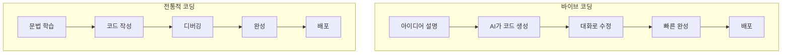

# 바이브 코딩 (Vibe Coding) 부트캠프

바이브 코딩과 바이브 코딩을 위한 디자인을 배웁니다. 4일 짧은 기간에 진행되기 때문에 수업시간 외 충분한 연습이 필요합니다. 

---

* 영상은 녹화되어 제공됩니다.
* 각 강의마다 필요한 강의가 더 필요하면 평생 무료 쿠폰을 드립니다.(15만원 상당)
* 강의자료는 1일차만 이 서비스를 통해 제공됩니다. 나머지 강의자료는 디스코드로 안내가 나갑니다.
* https://weniv.github.io/mdpre/ 에서 '발표자료 선택' 클릭 후 '프레젠테이션 로드'를 통해 강의자료를 불러오시면 됩니다.
* 강의자료는 로드된 뒤에 하단 메뉴에서 '마크다운 다운로드'를 누르시면 됩니다. PDF는 조금 깨질 수 있습니다.

---

사전 안내된 참가자 안내사항 링크입니다.

링크: https://weniv.link/8vLn6V

---

## 1일차

* 바이브 코딩의 이해와 환경세팅
* 기반지식 학습
* 배포
* 바이브 코딩의 프롬프트 입력 방법
* (매우매우 중요) 프롬프트 과제

---

## 2일차
* 바이브 코딩을 위한 디자인
* UI/UX 디자인 기초 지식
* Claude Code 디자인 적용 방법
* 생성형 AI 활용 브랜드 디자인
* Figma 기초

---

## 3일차
* 백엔드 연결 등 고급 기능 설계
* 고급 기능을 위해 알아야 할 지식
* final 과제

---

## 4일차
* 각자 제작한 결과물 발표(10명 - 10분씩 발표)
* 발표는 모두가 하는 것이 아니라 하고 싶은 분만 합니다. (1기에 한 분은 바이브 코딩으로 페이스북에서 1300좋아요와 공유 420회를 달성하셨습니다. 열심히 하셔서 공감도 받으시고, 원하는 결과물도 가져가시는 시간이 되셨으면 합니다.)

---

## 바이브 코딩이란?

SW 생산의 새로운 패러다임입니다. AI와 함께 대화하면서 코드를 생성하고, 수정하며, 실행하는 방식입니다. 특히 이전처럼 Code를 직접 짜는 것이 아니라 AI 발전으로 '자연어'만으로 원하는 것을 만들 수 있게 되었습니다.

---


---

{center}
백문이 불여일견
{/center}

---

만드는 것과 별개로 '개시'를 해야 합니다. 다른 사람들이 접속할 수 있도록요. 이 '개시'를 하는 행위를 '배포'라고 합니다.

---

앞으로 자주 보게 될 페이지이니 캡쳐해두세요. 배포를 어디서 하는가는 '쉬운가?', '무료인가?' 이 2가지 기준으로 선택을 했습니다.


---

바이브 코딩에 대한 오해와 수업방식 - 1

* Q: 바이브 코딩은 노코드인가요?
* A: 바이브 코딩은 노코드나 로우코드와는 다릅니다. 노코드나 로우코드는 코드를 작성하지 않거나 최소한으로 작성하는 방식입니다. 바이브 코딩은 AI와 대화하면서 코드를 생성하고 수정하는 방식입니다. 오히려 엄청난 코드를 생성하는 행위인 것이죠.

---

바이브 코딩에 대한 오해와 수업방식 - 2

* Q: 명령어 한 번에 휘리릭 되는 것 아닌가요?
* A: 코드를 짜는 시간을 1/30 ~ 1/50로 단축을 시킬 수는 있어도 1/10000 내 마음까지 꿰뚫어보며 극적으로 단축시켜주는 것은 아닙니다. 예를 들어, 자사의 서비스인 위니북스는 6개월 프로젝트였는데요. 이런 프로젝트를 2 ~ 3일만에 만들 수는 없습니다. 또한 '뭘 만들어야 할지 모르는 상태에서 뭘 만들어야 할지 구체화'시키는 것에 가장 많은 시간이 들어갑니다.

---

바이브 코딩에 대한 오해와 수업방식 - 3

* Q: 바이브 코딩은 코딩을 배우지 않아도 되나요?
* A: 어느정도 수준을 바라느냐에 따라 다를 것 같습니다. 간단한 페이지라면 코딩을 안배워도 되지만, 조금만 복잡도가 올라가도 코딩 지식이 있어야 수정이 용이합니다. 예를 들어, '버튼을 빨간 색으로 바꿔줘'라고 하는 것보다는 'btn 클래스에 색상을 빨간색으로 바꿔줘'라고 하는 것이 더 명확한 지시이며, 수정을 보다 잘 합니다.

---

바이브 코딩에 대한 오해와 수업방식 - 4

* Q: 바이브 코딩은 AI가 모든 것을 해주나요?
* A: 그렇지 않습니다. 처음 나온 결과물은 실망스럽기 그지 없을 것이고요. 계속해서 수정해나가야 합니다. 또한 이렇게 수정된 것을 남들이 접속할 수 있게 '배포'하는 과정도 여러분의 몫이죠.

---

바이브 코딩에 대한 오해와 수업방식 - 5

* Q: 수업만 들으면 바이브 코딩 잘하나요?
* A: 만약 여러분이 피아노 학원을 다니는데 하루에 1시간도 연습을 하지 않는다면, 피아노를 잘 칠 수 없습니다. 악보 보는 법과 악기를 다루는 방법을 가르쳐 드리지만, 연습할 시간이 충분히 확보되어 있는 부트캠프는 아닙니다. 따라서 실습 시간이 많이 편성 되어 있지 않으니 꼭 개인적으로 연습을 부탁드립니다. 특히 주말이요. 일부러 주말을 편성한 것입니다.

---

앞서 우리가 본 것처럼 이렇게 쉽게 만들 수 있다면, 시장 가격도 낮아질까요?

---

물론입니다. 이미 아는 대표님이 매우 낮은 가격으로 제공하고 있으신 것을 보았습니다. 바이브 코딩으로 이 단가가 나온다고 하시더군요. 50만원대에 프론트와 백엔드를 다 하고 있으셨습니다. 이전이었으면 말도 안되는 단가죠.

그럼에도 앞으로는 여러분이 직접 만들 수 있기 때문에 의뢰를 하는 것보다 직접 만드는 것을 더 선호하게 될 것입니다. 자연어로 만들 수 있기 때문이죠.

---

{center}
그래서 어디까지 만들 수 있나요?
{/center}

---


여러분이 보고 있으신 이 서비스도 바이브 코딩으로 만들어졌습니다.

* 참고로 강의자료는 마크다운으로 다운로드 받아주세요. PDF기능은 손을 보고 있습니다.

---

* 간단한 창업 MVP
* 간단한 회사 소개 렌딩 페이지
* 간단한 게임 (Asset이 있다면 더 멋지게 가능)
* 간단한 쇼핑몰
* 간단한 게시판
* 간단한 블로그
* 간단한 게스트하우스 예약 페이지
* 간단한 감귤 판매 페이지 

---

복잡한 것은 못만드나요?

---

만들 수는 있습니다. 제가 드리는 강의 쿠폰을 가지고, 코딩을 공부하세요. 그러면 더 복잡한 것도 가능합니다.

새로운 것을 배운다는 것이 두렵고, 클릭 한 번, 엔터 한 번에도 긴장이 되시겠지만, 그 벽을 넘으면 날개가 되어줄 것입니다.

---

공부 안하면 못만드나요?

---

매우 힘들게, 많은 질문을 하면서 만들 수는 있을 것 같습니다. 하지만 안개속에서 길을 찾는 것처럼 항상 그 길이 모호할 것입니다. 왜 이렇게 만들어지는지 충분한 이해가 없기 때문에 답답한 것은 덤이죠.

---

직접 해보고 싶어요!

---

아래 가이드를 참고하여 직접 해보는 시간을 가지겠습니다. 사전 과제로 드린 내용입니다.

설치 가이드: https://weniv.link/VZ_h_Z

---

가벼운 실습 시간 - 1

먼저 VSCode에 폴더가 선택이 되어 있어야 하는데요. `File` > `Open Folder`를 통해 폴더를 선택해주세요. `Terminal` > `New Terminal`을 통해 터미널을 열고, 아래 명령어를 입력해주세요.

* gemini를 사용하시는 분: gemini
* claude를 사용하시는 분: claude

---

가벼운 실습 시간 - 2

이제 아래와 같은 프롬프트를 입력해보세요.

```
프롬프트: 
나는 바이브 코딩을 강의하는 강사야. 
바이브 코딩을 소개하고, 수강 시청을 할 수 있는 랜딩 페이지를 만들어줘. 
랜딩 페이지에 들어가는 접수 폼의 링크는 아래 링크를 참고해줘.
    - 링크: https://forms.gle/Ddj742DqPZ5Eb8j79
HTML, CSS, JavaScript로 만들어줘. 
```

---

만들어진 파일을 실행시켜보기 위해서는 해당 폴더가 있는 위치로 찾아가 `index.html` 파일을 더블클릭하면 됩니다.

---

VSCode에서 파일 위치를 찾는 방법은 파일을 누르고 마우스 오른쪽 버튼을 클릭한 후 `Reveal in Explorer`를 선택합니다. 그러면 파일이 있는 폴더가 열립니다. 이 폴더에서 `index.html` 파일을 더블 클릭하면 브라우저에서 실행됩니다.


* 개발자 분들은 라이브 서버로 실행시키세요.
* 비개발자 분들도 라이브 서버를 설치하고 실행시키시는 것을 권합니다. 수업에서 시연해드리겠습니다.

---

가벼운 실습 시간 - 3

여러분들이 고치고 싶은 것을 몇 가지 수정하고, 캡쳐한 이미지를 업로드하는 시간을 가지겠습니다.

---

이렇게 계속 대화하면서 수정해나가는 것이 바이브 코딩입니다.

---

# 전통적 코딩 vs 바이브 코딩

{center}

{/center}

---

* Q: 우리는 결과물을 어떻게 만드나요?
* A: 물론 여러분이 직접 Gemini CLI로 결과물을 만들 수도 있지만 무료 버전이기 때문에 결과물의 퀄리티가 그리 좋지 않습니다. 그래서 아래와 같은 step을 거쳐서 결과물을 만들 예정입니다.

---

1. (여러분) 강사가 올린 샘플을 보고 요구사항을 작성합니다. 2일차 자정까지 작성을 부탁드립니다. 과제 첫줄에 Claude로 제가 돌려드려야 하는 여부도 함께 작성해주세요. 예를 들어, "강사님, 이 요구사항은 클로드로 돌려주세요."라고 첫 줄에 작성해주시면 됩니다.
2. (강사) 여러분의 요구사항을 적절히 수정합니다. 기술적인 부분 때문입니다.
3. (강사) 수정한 요구사항을 클로드로 돌립니다. 압축한 파일을 여러분에게 전달합니다.
4. (여러분) 이 파일을 Gemini CLI로 결과물을 완성해갑니다.

여러분이 1번과 4번을 해주시면 됩니다. 2번과 3번이 필요 없으신 개발자이시거나 클로드가 이미 결제되어 있으신 분은 직접 클로드로 돌려주세요.

---

간단한 요구사항 가지고 결과물 만들기 실습

```md
# 바이브 코딩 부트캠프 랜딩 페이지

## 프로젝트 개요
바이브 코딩 부트캠프를 소개하고, 수강 신청을 유도하는 랜딩 페이지입니다. 

## 기술 스택
- HTML, CSS, JavaScript
- Tailwind CSS (스타일링)

## 디자인 요구사항
* 이미지는 임시 이미지로 https://picsum.photos/ 사용

### 페이지 구성
* 메인 페이지
* 후기 페이지
* 이전 기수 결과물 페이지
* 수강 신청 페이지

### 메인 페이지 레이아웃
- 헤더: 바이브 코딩 로고, 네비게이션 메뉴
- 메인 섹션: 부트캠프 소개, 강의 내용, 강사 소개, 수강 신청 버튼
- 푸터: 연락처 정보, 소셜 미디어 링크

### 참고 서비스
- apple의 맥북 소개 페이지가 항상 깔끔하고 마음에 들어. 이와 유사하게 바이브 코딩 부트캠프를 소개하는 페이지를 만들고 싶어.

## 추가 고려사항
- 랜딩 페이지에 들어가는 접수 폼의 링크는 https://forms.gle/Ddj742DqPZ5Eb8j79
```