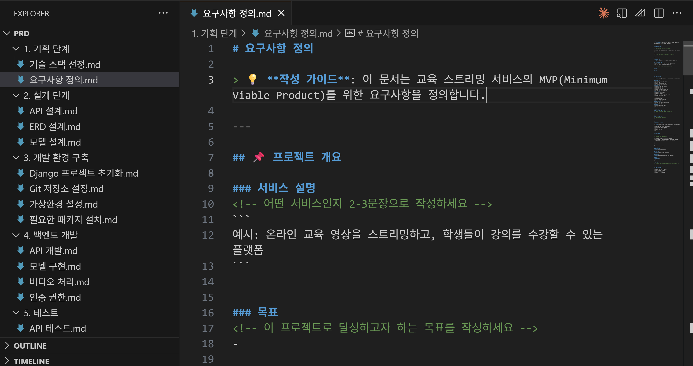
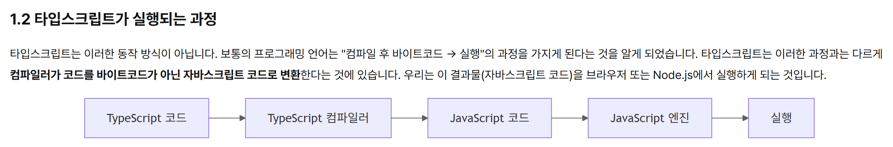
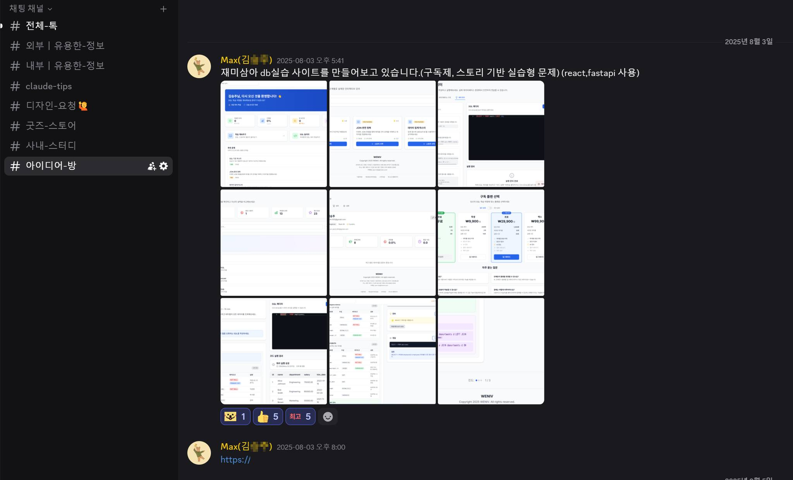
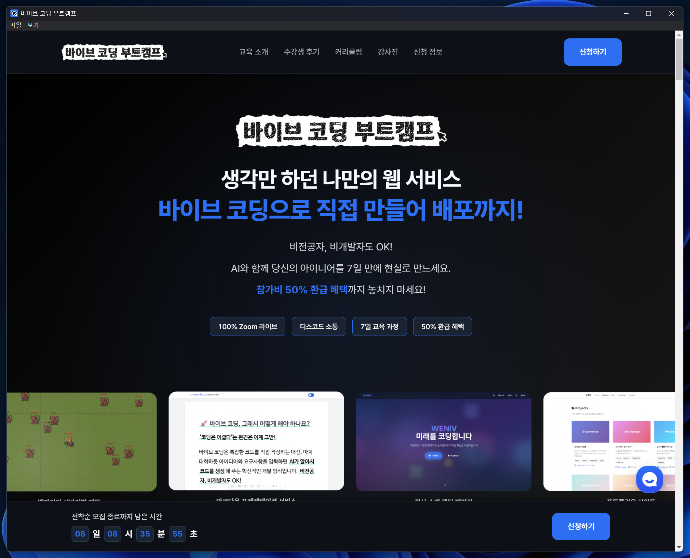
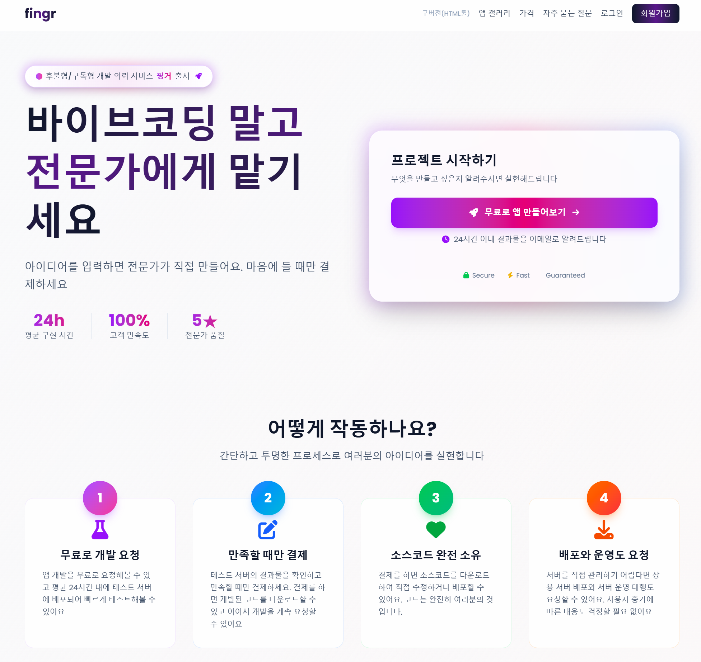

# AI 활용 사례와 업무 생산성 혁신

목표: 바이브 코딩(Claude Code)으로 업무 프로세스가 어떻게 바뀌어가고 있는지 이해, MCP를 통해 LLM을 효과적으로 활용할 수 있는 방법을 이해

---

* 이것이 가능한 도전일까요?

---

SW 생산의 새로운 패러다임입니다. AI와 함께 대화하면서 코드를 생성하고, 수정하며, 실행하는 방식입니다. 특히 이전처럼 Code를 직접 짜는 것이 아니라 AI 발전으로 '자연어'만으로 원하는 것을 만들 수 있게 되었습니다.

---

{center}
바이브 코딩으로 간단한 랜딩 페이지 만들기 실습
{/center}

---

위니브는 7월 말부터 바이브 코딩을(Claude Code) 공식으로 회사에 도입했습니다. 이것을 쓰지 않는다면, 쓰지 않는 것만으로도 업무상 배임에 해당될 정도로 강력한 도구입니다.

---

위니브에서는 CAIO를 선임하여 전사적으로 AI 활용을 필수로 하도록 하고 있습니다. 그 중 핵심이 되는 것은 바로 프롬프트 라이브러리입니다.

---

---

---

위니브 내부에서 Claude Code를 사용하는 팀 - 모든 팀!

* 개발팀
* 디자인팀
* 기획팀
* 마케팅팀
* 경영지원팀 - 영상: https://youtu.be/oM65SNNrvws
* 교육팀

---

* 위니북스에 도입된 머메이드: 개발자가 수개월 걸려 개발해야 하는 소스코드를 단 몇 분만에 생성

---

* 위니브 아이디어 방에 올라온 제품: 아이디어가 아니라 제품이 올라오는 시대

---

* 수천만원 서비스를 단 몇 분에 할 수 있는 시대(단, 누구나 할 수 있는 것은 아닙니다)

---

* 결과물

---

이러한 변화를 겪고, 회사에서 토론회를 거치면서 위니브는 바이브 코딩이 새로운 개발 패러다임으로 생각하고, 관련된 콘텐츠와 교육을 제공하기 시작했습니다.

---

* 디자이너가 만든 바이브 코딩 부트캠프 웹 페이지: 코드를 전혀 모르는 디자이너가 바이브 코딩으로 직접 제작
* https://vibe.weniv.co.kr/

---

{center}
figma의 make, mcp 활용 개발 실습
{/center}

---

* MCP: Model Context Protocol
* 링크: https://www.books.weniv.co.kr/basecamp-mcp

---

---

방금 보신 페이지는 앱입니다. 이러한 데스크톱 앱 뿐만 아니라 실제 부트캠프 수강생 분들은 크롬 확장 프로그램, 크롬 시작 페이지 등 다양한 형태로 바이브 코딩을 활용하고 있습니다.

---

* 위니브 디자이너가 개발하고, 개발자가 약간 손을 본 페이지
* https://camp.weniv.co.kr/

---

* 바이브 코딩을 위한 서비스
* https://canvas.weniv.co.kr/

---

* 바이브 코딩 강의를 위한 서비스
* https://weniv.link/webpageguide

---

* 어디까지 개발이 가능할까요?

---

{center}
초급자가 백엔드까지 개발하는 프롬프트
{/center}

---

## 바이브 코딩에 대한 오해

---

바이브 코딩에 대한 오해 - 1

* Q: 바이브 코딩은 노코드인가요?
* A: 바이브 코딩은 노코드나 로우코드와는 다릅니다. 노코드나 로우코드는 코드를 작성하지 않거나 최소한으로 작성하는 방식입니다. 바이브 코딩은 AI와 대화하면서 코드를 생성하고 수정하는 방식입니다. 오히려 엄청난 코드를 생성하는 행위인 것이죠.

---

바이브 코딩에 대한 오해 - 2

* Q: 명령어 한 번에 휘리릭 되는 것 아닌가요?
* A: 코드를 짜는 시간을 1/30 ~ 1/50로 단축을 시킬 수는 있어도 1/10000 내 마음까지 꿰뚫어보며 극적으로 단축시켜주는 것은 아닙니다. 예를 들어, 자사의 서비스인 위니북스는 6개월 프로젝트였는데요. 이런 프로젝트를 2 ~ 3일만에 만들 수는 없습니다. 또한 '뭘 만들어야 할지 모르는 상태에서 뭘 만들어야 할지 구체화'시키는 것에 가장 많은 시간이 들어갑니다.

---

바이브 코딩에 대한 오해 - 3

* Q: 바이브 코딩은 코딩을 배우지 않아도 되나요?
* A: 어느정도 수준을 바라느냐에 따라 다를 것 같습니다. 간단한 페이지라면 코딩을 안배워도 되지만, 조금만 복잡도가 올라가도 코딩 지식이 있어야 수정이 용이합니다. 예를 들어, '버튼을 빨간 색으로 바꿔줘'라고 하는 것보다는 'btn 클래스에 색상을 빨간색으로 바꿔줘'라고 하는 것이 더 명확한 지시이며, 수정을 보다 잘 합니다.

---

바이브 코딩에 대한 오해 - 4

* Q: 바이브 코딩은 AI가 모든 것을 해주나요?
* A: 그렇지 않습니다. 처음 나온 결과물은 실망스럽기 그지 없을 것이고요. 계속해서 수정해나가야 합니다. 또한 이렇게 수정된 것을 남들이 접속할 수 있게 '배포'하는 과정도 여러분의 몫이죠.

---

바이브 코딩에 대한 오해 - 5

* Q: 위니브 프롬프트 라이브러리 가져다 쓰면 다른 곳에서도 바로 사용할 수 있나요?
* A: 그렇지 않습니다. 프롬프트 라이브러리는 그 회사 사정에 맞게 모두 변경하셔야 합니다. 어떠한 구조로 이뤄지는지는 참고할 수 있지만 일관된 프롬프트 라이브러리는 있을 수 없습니다.

---

바이브 코딩에서 사람의 역할은 디렉터 또는 PM의 역할입니다. 여러분이 다니는 회사가 개발 회사라는 가정 하에 회사에 코드를 전혀 이해하지 못하는 사람이 디렉터 또는 PM으로 왔다고 생각한다면 이해가 쉬울 것입니다.

---

## 바이브 코딩으로 인한 시장의 변화

---

앞서 우리가 본 것처럼 이렇게 쉽게 만들 수 있다면, 시장 가격도 낮아질까요?

---

물론입니다. 이미 아는 대표님이 매우 낮은 가격으로 제공하고 있으신 것을 보았습니다. 바이브 코딩으로 이 단가가 나온다고 하시더군요. 50만원대에 프론트와 백엔드를 다 하고 있으셨습니다. 이전이었으면 말도 안되는 단가죠.

그럼에도 앞으로는 여러분이 직접 만들 수 있기 때문에 의뢰를 하는 것보다 직접 만드는 것을 더 선호하게 될 것입니다. 자연어로 만들 수 있기 때문이죠.

---

워낙 빠르게 개발이 가능하기 때문에 시간단위 CTO, 시간단위 PM도 생겨나기 시작했습니다. 월 40시간 미만으로만 일해주는 분들이 생겨나고 있죠.

---

---

## 바이브 코딩으로 만들 수 있는 것

---

{center}
그래서 어디까지 만들 수 있나요?
{/center}

---

여러분이 보고 있으신 이 서비스도 바이브 코딩으로 만들어졌습니다.
* https://weniv.github.io/mdpre/

---

* 간단한 창업 MVP
* 간단한 회사 소개 렌딩 페이지
* 간단한 게임 (Asset이 있다면 더 멋지게 가능)
* 간단한 쇼핑몰
* 간단한 게시판
* 간단한 블로그
* 간단한 게스트하우스 예약 페이지
* 간단한 감귤 판매 페이지 

---

복잡한 것은 못만드나요?

---

만들 수는 있습니다. SW 개발을 공부하세요. 그러면 더 복잡한 것도 가능합니다.

---

바이브 코딩은 별도로 공부해야 합니다.
* 프롬프트 디자인 시스템
* 요구사항 명세서
* 바이브 코딩을 위한 프롬프트 엔지니어링
* 바이브 코딩 명령어

---

공부 안하면 못만드나요?

---

매우 힘들게, 많은 질문을 하면서 만들 수는 있을 것 같습니다. 하지만 안개속에서 길을 찾는 것처럼 항상 그 길이 모호할 것입니다. 왜 이렇게 만들어지는지 충분한 이해가 없기 때문에 답답한 것은 덤이죠.

---

공부를 안해도 만들수는 있잖아요?

---

공부를 안하고 여러 토이 프로젝트를 하시면서 원하시는 지식을 송곳처럼 배워가시는 프로세스를 권해드립니다.

---

## 바이브 코딩의 한계와 미래

---

* 컨텍스트 제약
* 최신 정보 부재
* 개발하면서 민감 정보 노출
* 생산된 코드의 보안 취약점
* 생산된 코드의 블랙박스
* AI에 대한 과도한 의존
* 디버깅의 어려움(실제 도입을 미룬 사례)
* 비용과 접근성

---

그럼에도 불구하고
* SW 개발의 민주화, 대중화(AI Full Stack Developer)
* SW 개발의 고도화
* SW 개발의 자동화