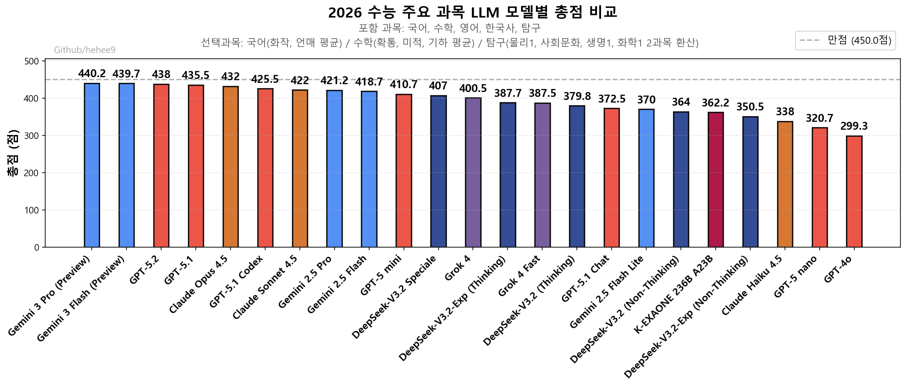

# 생성형AI와 미래 교육의 방향 

---

아마 여러분은 다음과 같은 이미지 생성 프롬프트를 배우러 오셨을 수도 있습니다.

---

---

또는 다음과 같은 영상 생성 프롬프트를 배우러 오셨을 수도 있습니다.

---

<video controls>
  <source src="https://weniv.github.io/mdpre/93_생성형AI와_교육/images/danse.mp4" type="video/mp4">
  Your browser does not support the video tag.
</video>

---

또는 어떠한 플랫폼에 '차이'를 설명해주는 강의를 기대하셨을 수도 있습니다.

* link: https://www.youtube.com/watch?v=qrPtpr0ihhI

---

또는 요즘 핫한 아래와 같은 벤치마크를 보여드리며, '지금은 이 AI가 최고입니다'라는 강의를 기대하셨을 수도 있습니다.

* 출처: https://github.com/hehee9/2026-CSAT

---

그러나 이 모든 것들은 이제 ChatGPT나 Claude, Gemini와 같은 생성형 AI가 답변을 가지고 있습니다. 여러분 개개인이 궁금한 것을 물어보면 됩니다.

---

그러면 제가 얘기해야할 것은 무엇일까요? 이것이 오늘 강의의 핵심이라 볼 수 있습니다. 저와 여러분은 강의자와 수강생이지만, 동시에 여러분은 교실에서 강의자와 수강생이기도 하기 때문입니다.

---

질문을 바꿔보죠. 여러분이 교실에서 얘기해야할 것은 무엇인가요? 그것이 아직 유효한가요?

---

1. 시대의 흐름을 보는 눈
2. 개인이 가져야할 질문

저는 이 2가지를 강의하러 왔습니다.

---

아, 한 가지가 빠졌군요.

3. 요청하신 생성형 AI, 교육, Gemini 관련 내용

이것도 진행하겠습니다. 순서대로 가보도록 하죠.

---

첫번째 입니다. 시대는 얼마나 바뀌었을까요?

---

---

위니브는 20명 정도 되는 직원이 모두 생성형 AI를 사용하고 있는 기업입니다. 특히 Claude Code라는 생성형 AI 코딩 도구를 적극 활용하고 있습니다.

---

* 위니브 아이디어 방에 올라온 제품: 아이디어가 아니라 제품이 올라오는 시대

---

* 수천만원 서비스를 단 몇 분에 할 수 있는 시대(단, 누구나 할 수 있는 것은 아닙니다)

---

* 결과물

---

* 디자이너가 만든 바이브 코딩 부트캠프 웹 페이지: 코드를 전혀 모르는 디자이너가 바이브 코딩으로 직접 제작
* https://vibe.weniv.co.kr/

---

우리의 모든 업무는 아래와 같은 순서로 이뤄집니다.

---

1. 일일업무 생성
2. 우선순위 할당
3. 프롬프트 작성
4. Claude Code 실행
5. 결과물 검토 및 수정
6. 결과물 적용 및 공유

---

이제 더이상 업무에 '엑셀'이나 '파워포인트'가 없습니다. 서류업무는 거의 없습니다. 모든 업무는 생성형 AI와의 상호작용으로 이뤄집니다. 무엇을 어떻게 생성형 AI에게 요청할지에 대한 '프롬프트 작성'이 우리의 핵심 업무입니다.

---

(실습)

실제 업무를 하는 모습을 잠시 보시죠.

---

여러분은 이런 시대에 살고 있으십니다.

---

두번째로는 '가져야할 질문'입니다. 우리는 이런 시대에 무엇을 배워야 할까요? 무엇을 '질문'으로 삼아야 할까요? 무엇이 우리가 알아야할 '지식'일까요?

---

추상적이죠. 그리고 시대가 흘러감에 따라 답이 변화될 것입니다. 우리는 달리는 기차 위에 타고 쏜 총알과 같은 속도로 변화하는 시대에 살고 있기 때문입니다.

---

좀 더 구체적으로, 제가 만약 이 자리에 앉아있다면 '그러면, 지금 어떻게 생성형 AI와 함께 교육이나 업무에 활용할 수 있을까? 더 잘 활용하는 방법은 무엇일까?'라는 질문을 할 것입니다.

---

역시나 가볍게 강의할 수 있는 강의는 아닙니다. 아래 내용을 가볍게 요약하면서 말씀을 드려보도록 하겠습니다. 위니브에서 집필한 책입니다.

링크: https://www.books.weniv.co.kr/essentials-chatgpt/chapter03/03-1

---

이러한 프롬프트에 대한 개념이 어느정도 잡히셨다면, 이제 교육 분야에서 생성형 AI를 어떻게 활용할 수 있을지 구체적인 예시를 보여드리도록 하겠습니다.

---

# 지리 교육

"나는 지리 선생님이야. 제주도의 오름을 학습하는 인터랙티브 지도를 만들고 싶어. Python의 folium 라이브러리를 사용해서 제주도 지도에 대표적인 오름 3곳(성산일출봉, 다랑쉬오름, 용눈이오름)을 마커로 표시하고, 각 마커를 클릭하면 해당 오름의 이름, 높이, 특징을 팝업으로 보여주는 HTML 파일을 만들어줘. 지도의 중심은 제주도(위도 33.3617, 경도 126.5292)로 하고 줌 레벨은 10으로 설정해줘."

---

링크: https://weniv.github.io/mdpre/sample/001.html

---

# 과학 교육

"나는 중학교 과학 선생님이야. 태양계 행성의 공전과 자전을 시각적으로 학습할 수 있는 3D 시뮬레이션을 만들고 싶어. Three.js를 사용해서 태양, 수성, 금성, 지구, 화성을 구현해줘. 각 행성은 실제 공전 주기 비율을 반영해서 움직이고, 자전도 함께 표현해줘. 태양은 빛을 발하는 효과를 주고, 지구에는 달도 추가해줘. 마우스 드래그로 시점을 자유롭게 회전할 수 있고, 숫자 키 1-4를 누르면 각 행성에 카메라가 포커스되도록 해줘. 우측 상단에는 각 행성의 이름과 공전 주기 정보를 표시하는 HTML 파일을 만들어줘."

---

링크: https://weniv.github.io/mdpre/sample/002.html

---

# 수학 교육

"나는 고등학교 수학 선생님이야. 이차함수 `y = ax**2 + bx + c`와 같은 개념을 시각적으로 가르칠 수 있는 인터랙티브 도구를 만들고 싶어. HTML 파일로 만들어줘. Chart.js나 D3.js를 사용해서 여러 2차 함수에 대한 그래프를 그릴 수 있는 도구를 만들어줘. 사용자가 `a`, `b`, `c` 값을 입력하면 해당 이차함수의 그래프가 실시간으로 업데이트되도록 해줘."

---

링크: https://weniv.github.io/mdpre/sample/003.html

---

## 바이브 코딩으로 인한 교육의 변화

* 답은 없습니다. 질문만 있습니다. 부정적으로 이야기 하려는 의도는 없습니다. 다만, 시대가 우리에게 요구하는 질문이라 생각합니다.

---

우리가 전통적으로 배워왔던 SW 교육, 인공지능 교육, 데이터 교육, 일반 교육 등이 아직도 그 프로세스 그대로 유효할까요?

---

'지성'과 '지능', '교육'과 '숙련'은 어떤 의미를 가지고 있나요?

---

이러한 시대에 수능은 어떤 의미를 지니고 있나요?

---

* 초등학교 2학년 어린이가 3일만에 만든 게임: https://weniv.github.io/minhogame/

---

* 미래 학생들이 살아가야 할 세상은 AI와 공존하는 세상입니다. 이것을 부정하시는 분은 없으실겁니다. 많이 써보게 하고, AI와 협업하는 방법을 익히게 해야 합니다.

---

* 솔로프리너의 시대
* 평범의 종말: 기존 관습대로 살아남기 힘든 시대

---

여러가지 질문 속에서 저희 회사가 내놓은 답변은 'AI와 창업 중심 학교 설립'입니다. 함덕에 새워집니다. 27년 개교 확정이에요. 중, 고, 대학교입니다.

---

만들면서 배우는 시대

---

마지막 요청 사항에 대한 답변입니다. 생성형 AI, 교육, Gemini 관련 내용입니다. 여기서 교육 활용은 앞에서 했으니 생성형 AI와 Gemini에 대해 간단히 말씀드리도록 하겠습니다.

---

생성형 AI란 무엇일까요? 앞서 언급한 강의자료에도 있습니다.

링크: https://www.books.weniv.co.kr/essentials-chatgpt/chapter03/03-1

---

(실습)

지금 Google 솔루션 중에서는 가장 주목받고 있는 것은 아래 3가지입니다. 하나씩 어떻게 사용하는지 설명드리도록 하겠습니다.

* Gemini
* NotebookLM
* Antigravity
