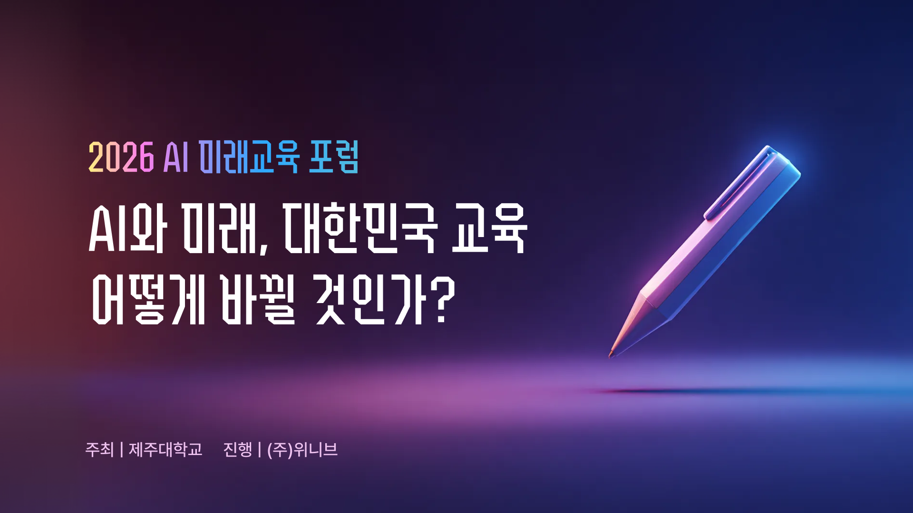
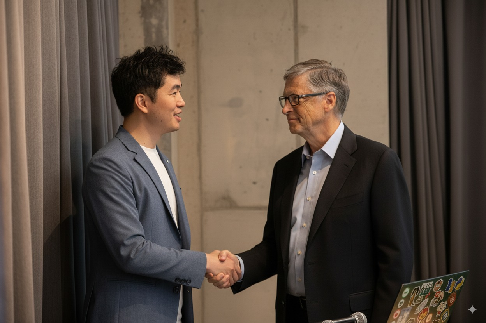
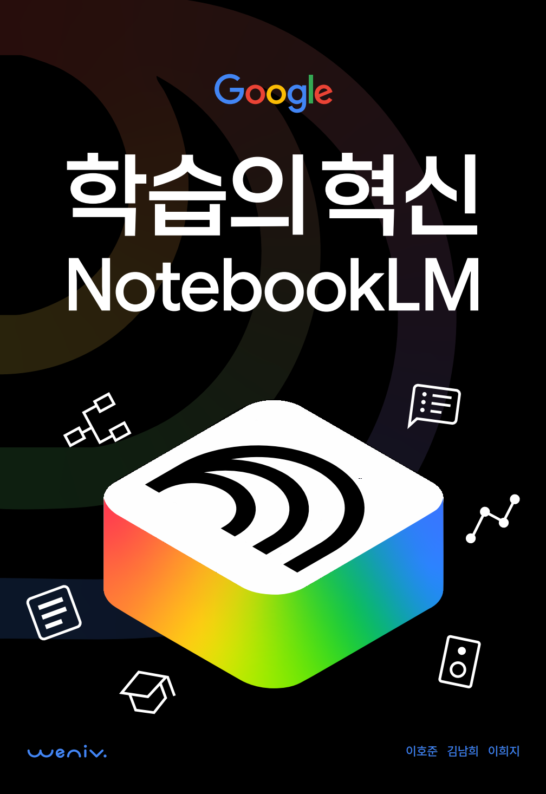

# AI와 미래, 대한민국 교육 어떻게 바뀔 것인가?

* 일시: 2026년 1월 10일 토요일 09:00 ~ 10:30
* 장소: 제주 신화월드

---

---

## 기억해야 할 내용

1. 시대 흐름 - 얼마나 변화되었는가?
2. 교육이 가져야 할 질문 - 무엇을 학습해야 하는가?
3. AI 시대, 교육의 방향 - 어떻게 바뀌어야 하는가?

---

여러분은 다음과 같은 이미지 생성 프롬프트를 기대하셨을 수 있습니다.

---

---

또는 다음과 같은 영상 생성 프롬프트를 기대하셨을 수도 있습니다.

---

<video controls>
  <source src="https://weniv.github.io/mdpre/93_생성형AI와_교육/images/danse.mp4" type="video/mp4">
  Your browser does not support the video tag.
</video>

---

또는 어떠한 AI 플랫폼에 '차이'를 설명해주는 강의를 기대하셨을 수도 있습니다.

* link: https://www.youtube.com/watch?v=qrPtpr0ihhI

---

또는 요즘 핫한 아래와 같은 벤치마크를 보여드리며, '지금은 이 AI가 최고입니다'라는 강의를 기대하셨을 수도 있습니다.

* 출처: https://github.com/hehee9/2026-CSAT

---

또는 요즘 교육에서 많이 사용하는 NotebookLM과 같은 '교육에 사용할만한 AI 도구'를 배우러 오셨을 수도 있습니다.

---

그러나 '어떤 교육'에서 '무엇을 기대'하셨든 간에 그것은 3 ~ 4개월 안에 ChatGPT나 Claude, Gemini와 같은 생성형 AI에서 대부분 받을 수 있는 답변일 것입니다.

---

그러면 제가 이곳에서 얘기해야 할 것은 무엇일까요? 이것이 오늘 강의의 핵심이라 볼 수 있습니다. 

---

앞서 제시한 3가지 이 수업의 핵심 내용입니다. 다시 한 번 상기하고 가겠습니다. 마지막에 한 번 더 강조드리도록 하겠습니다.

1. 시대 흐름 - 얼마나 변화되었는가?
2. 교육이 가져야 할 질문 - 이런 시대에 무엇을 학습해야 하는가?
3. AI 시대, 교육의 방향 - 우리는 어떻게 바뀌어야 하는가?

---

## 1. 시대는 얼마나 바뀌었을까요?

---

AI로 우리 일상은 어떻게 바뀌었을까요? 우리가 일하는 방식은 어떻게 변화했을까요? 아쉽게도 TV에서, YouTube에서 이런 이야기를 말하는 것을 아직까지 본 적이 없습니다.

---

생존이 걸린 기업은 정말 빠릅니다.

---

회사에 출근해 진행하는 업무 프로세스는 아래와 같습니다.

1. 일일 업무 작성
2. 우선순위 할당
3. 프롬프트 작성
4. 생성형 AI 실행(Claude - Claude Code, Gemini - Gemini CLI, ChatGPT - Codex)
5. 결과물 검토 및 수정
6. 결과물 적용 및 공유

---

이제 더이상 업무에 '엑셀'이나 '파워포인트'가 없습니다. 서류업무는 거의 없습니다. 모든 업무는 생성형 AI와의 상호작용으로 이뤄집니다. 무엇을 어떻게 생성형 AI에게 요청할지에 대한 '프롬프트 작성'이 우리의 핵심 업무입니다.

---

위니브는 20명 정도 되는 직원이 모두 생성형 AI를 사용하고 있는 기업입니다. 특히 Claude Code라는 생성형 AI 도구를 적극 활용하고 있습니다.

---

* 위니브 아이디어 방에 올라온 제품: 아이디어가 아니라 제품이 올라오는 시대

---

* 수천만원 서비스를 단 몇 분에 할 수 있는 시대(단, 누구나 할 수 있는 것은 아닙니다)

---

* 결과물

---

* 디자이너가 만든 바이브 코딩 부트캠프 웹 페이지: 코드를 전혀 모르는 디자이너가 '바이브 코딩'으로 직접 제작
* https://vibe.weniv.co.kr/

---

**바이브 코딩**이라는 단어가 25년부터 큰 호응을 얻고 있습니다. 이는 SW 생산과 교육, 업무의 새로운 패러다임입니다. AI와 함께 대화하면서 결과물을 생성하고, 수정하며, 실행하는 방식입니다.

---

{center}
(실습)

실제 업무를 하는 모습을 잠시 보시죠.
{/center}

---

## 2. 무엇을 학습해야 할까요?

---

지금 보신 충격적인 장면을 보시고 어떤 생각이 드시나요?

---

학습(學習) 또는, 배움은 본능적인 변화인 성숙과는 달리, 직간접적 경험이나 훈련에 의해 지속적으로 자각하고, 인지하며, 변화시키는 행동 변화이다. - wiki

---

학습의 범위는 매우 넓습니다. 단순히 지식을 습득하는 것 뿐만 아니라, 기술을 익히고, 태도를 형성하며, 문제 해결 능력을 개발하는 것까지 포함됩니다.

---

여기서는 학습 중에서도 시험을 위한 지식 또는 기술을 위한 지식에 초점을 맞춰보도록 하겠습니다. 민감한 얘기는 하지 않고, 모두가 공감할만한 내용만 하겠습니다.

---

우리는 '달리는 열차에서 총알을 쏘는 속도로' 변화하는 시대에 살고 있습니다. 예를 들어, 안경을 쓰면 모든 질문에 정해진 정답을 알려주는 고글을 쓴다고 가정해보겠습니다. 이제 곧 그런 시대가 올 것이라 가정해봅시다.

---

이 고글을 썼을 때 우리에게 의미있는 학습을 추려봅시다. 어떤 것이 있을까요?

---

죄송하지만 저에게 정답은 없습니다. 하지만 적어도 이 고글을 썼을 때 바로 정답을 알려주는 것들은 그 의미가 더 축소되는 시대가 될 것임은 분명합니다.

---

AI와 소통하는 공부는 더욱 중요해질 것은 분명합니다. 위니브에서 집필한 책을 보면서 가볍게 요약을 해보도록 하겠습니다.

링크: https://www.books.weniv.co.kr/essentials-chatgpt/chapter03/03-1

---

## 3. AI 시대, 교육의 방향

---

교육의 방향이 이렇게 변화될 것이다라고 예측할 수 있는 사람은 아무도 없습니다.

---

우리는 누구도 본 적 없고, 누구도 예측한 적 없는 시대를 살고 있습니다.

---

그래서 저는 각각의 과목에서 제가 수업을 한다는 가정을 하고 한 번 고민을 해보았어요.

---

### 3.1 지리 교육

"나는 지리 선생님이야. 제주도의 오름을 학습하는 인터랙티브 지도를 만들고 싶어. Python의 folium 라이브러리를 사용해서 제주도 지도에 대표적인 오름 3곳(성산일출봉, 다랑쉬오름, 용눈이오름)을 마커로 표시하고, 각 마커를 클릭하면 해당 오름의 이름, 높이, 특징을 팝업으로 보여주는 HTML 파일을 만들어줘. 지도의 중심은 제주도(위도 33.3617, 경도 126.5292)로 하고 줌 레벨은 10으로 설정해줘."

---

링크: https://weniv.github.io/mdpre/sample/001.html

---

### 3.2 과학 교육

"나는 중학교 과학 선생님이야. 태양계 행성의 공전과 자전을 시각적으로 학습할 수 있는 3D 시뮬레이션을 만들고 싶어. Three.js를 사용해서 태양, 수성, 금성, 지구, 화성을 구현해줘. 각 행성은 실제 공전 주기 비율을 반영해서 움직이고, 자전도 함께 표현해줘. 태양은 빛을 발하는 효과를 주고, 지구에는 달도 추가해줘. 마우스 드래그로 시점을 자유롭게 회전할 수 있고, 숫자 키 1-4를 누르면 각 행성에 카메라가 포커스되도록 해줘. 우측 상단에는 각 행성의 이름과 공전 주기 정보를 표시하는 HTML 파일을 만들어줘."

---

링크: https://weniv.github.io/mdpre/sample/002.html

---

### 3.3 수학 교육

"나는 고등학교 수학 선생님이야. 이차함수 `y = ax**2 + bx + c`와 같은 개념을 시각적으로 가르칠 수 있는 인터랙티브 도구를 만들고 싶어. HTML 파일로 만들어줘. Chart.js나 D3.js를 사용해서 여러 2차 함수에 대한 그래프를 그릴 수 있는 도구를 만들어줘. 사용자가 `a`, `b`, `c` 값을 입력하면 해당 이차함수의 그래프가 실시간으로 업데이트되도록 해줘."

---

### 3.4 SW 교육

* 초등학교 2학년 어린이가 3일만에 만든 게임: https://weniv.github.io/minhogame/

---

### 3.5 교육의 변화

* 미래 학생들이 살아가야 할 세상은 AI와 공존하는 세상입니다. 이것을 부정하시는 분은 없으실겁니다. 많이 써보게 하고, AI와 협업하는 방법을 익히게 해야 합니다.

---

* 솔로프리너의 시대
* 평범의 종말: 기존 관습대로 살아남기 힘든 시대