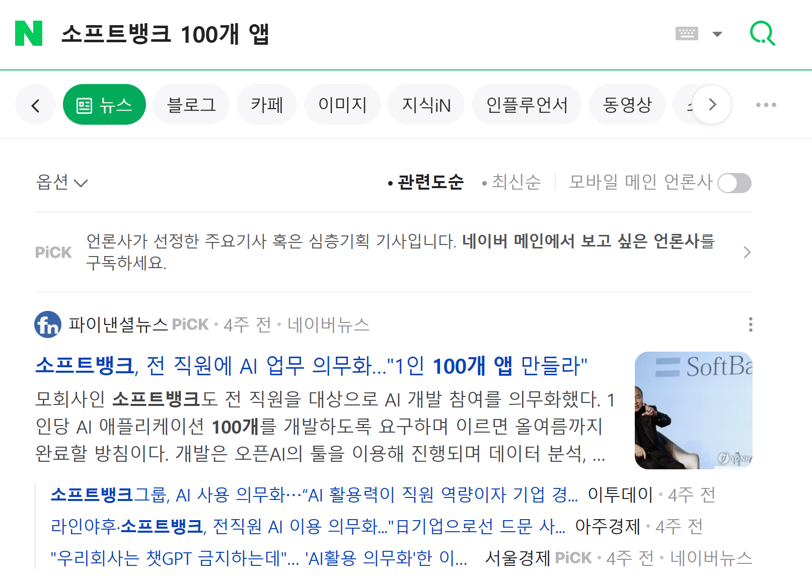
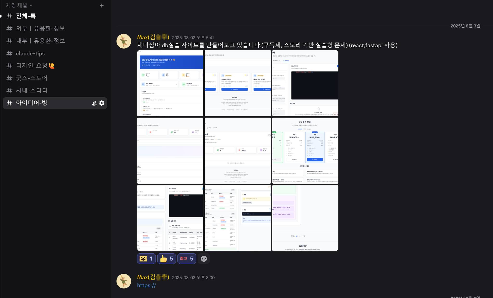
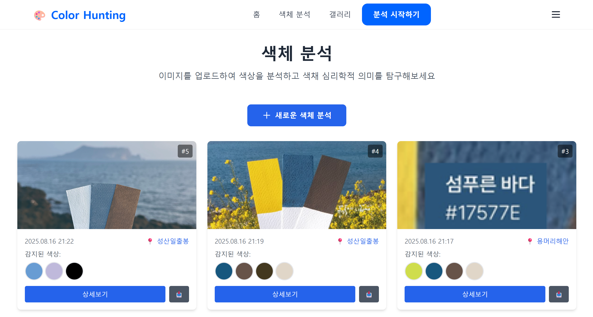
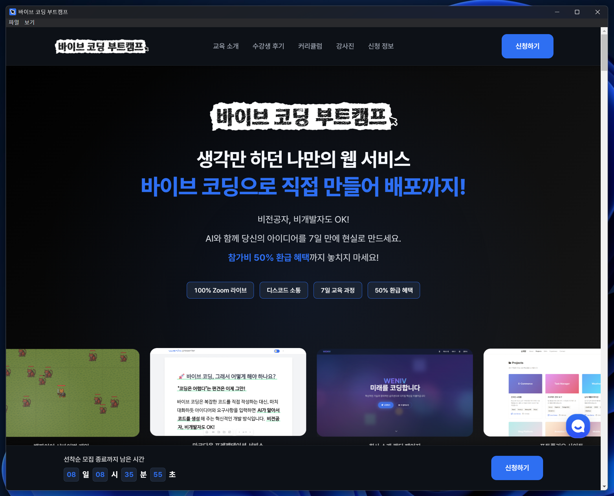
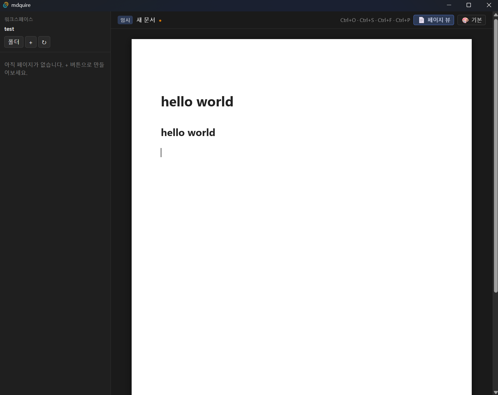
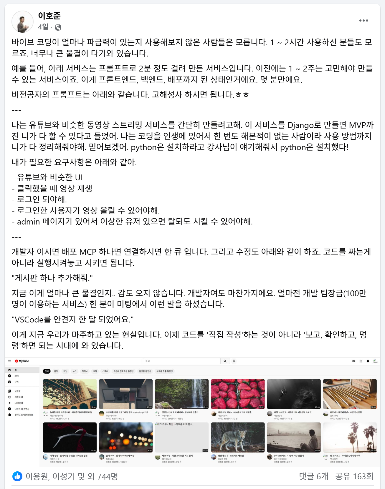

# AI 시대의 대변화, 바이브 코딩

---

* 이것이 가능한 도전일까요?

---

바이브 코딩의 흐름은 SW 생산의 새로운 패러다임입니다. AI와 함께 대화하면서 코드를 생성하고, 수정하며, 실행하는 방식입니다. 특히 이전처럼 Code를 직접 짜는 것이 아니라 AI 발전으로 '자연어'만으로 원하는 것을 만들 수 있게 되었습니다.

---

그런데 코딩만 할 수 있을까요? 그렇지 않습니다. 엑셀, 한글, 파워포인트 등 지금은 컴퓨터에서 다루는 대부분의 도구에 바이브 코딩이 붙어 자동으로 진행이 되고 있습니다.

---

잠시 시연이 있겠습니다.

---

* 위니브 아디이어 방에 올라온 제품

---

* 이러한 가능성에 개발을 해드린 서비스

---

* 결과물

---

* 디자이너가 만든 바이브 코딩 부트캠프 웹 페이지
* https://vibe.weniv.co.kr/

---

* 웹 페이지를 명령어 하나로 앱으로 생성
* 데스크톱 앱 뿐만 아니라 실제 부트캠프 수강생 분들은 크롬 확장 프로그램, 크롬 시작 페이지 등 다양한 형태로 바이브 코딩을 활용하고 있습니다.

---

* 노션 쓰시는 분 있으신가요? 인쇄가 불편하죠? 그래서 만들었습니다.

---

* 위니브 디자이너가 개발하고, 개발자가 약간 손을 본 페이지
* https://camp.weniv.co.kr/

---

* 바이브 코딩을 위한 서비스
* https://canvas.weniv.co.kr/

---

* 바이브 코딩 강의를 위한 서비스
* https://weniv.link/webpageguide

---

* 수억의 한글 제안서도 이제 바이브 코딩으로 진행을 하고 있습니다.
* https://www.books.weniv.co.kr/essentials-claude-cowork/chapter01/01-5

---

* 가장 많은 호응을 얻은 게시물

---

## 시장의 변화

---

<iframe width="100%" style="aspect-ratio: 16/9; height: auto;" src="https://www.youtube.com/embed/IIJEim3vdd8" title="AI 확산에 신입 채용 &#39;뚝&#39;…&#39;취업전선&#39; 청년들의 목소리 / JTBC 뉴스룸" frameborder="0" allow="accelerometer; autoplay; clipboard-write; encrypted-media; gyroscope; picture-in-picture; web-share" referrerpolicy="strict-origin-when-cross-origin" allowfullscreen></iframe>

---

무엇을 어떻게, 어디까지 준비해야 할까요?

---

## 더 이상 '코딩'만의 이야기가 아닙니다

---

이전에는 '도구를 다루는 능력'이 중요했습니다. 이제는 '문제를 정의하는 능력'이 더 중요해졌습니다.

---

AI가 대신해주는 것은 '구현'입니다. 그래서 무엇을, 왜, 어떻게 만들지 설명할 수 있는 사람이 결과를 만들어냅니다.

---

## 갖춰야 할 세 가지

---

* **문제를 정의하는 힘**
* "무엇을, 왜 만드는가"를 한 문장으로 설명할 수 있어야 합니다.

---

* **AI와 대화하는 힘**
* 좋은 질문이 좋은 결과를 만듭니다. 막연한 요청은 막연한 결과를 돌려줍니다.

---

* **결과를 판단하는 힘**
* AI가 내놓은 결과물이 정말로 맞는지, 더 나아질 수 있는지 평가할 수 있어야 합니다.

---

## 그래서, 어디까지 해봐야 할까요?

---

거창하게 시작하지 않아도 됩니다.

* 일상의 작은 불편을 해결하는 도구
* 반복 업무를 줄여주는 스크립트
* 내 아이디어를 시각화하는 한 페이지짜리 웹
* 내가 하던 것들을 자동화

---

이 정도만 직접 만들어봐도, 이미 다른 출발선에 서 있게 됩니다.

---

## 어떻게 시작할까요?

---

<iframe width="100%" style="aspect-ratio: 16/9; height: auto;" src="https://www.youtube.com/embed/8iTtBcKFt-o" title="[자막뉴스] &#39;무료 VS 30만원&#39; AI 요금제별 학교 과제 결과는?…&#39;AI격차&#39; 화두 / KBS 2026.04.26." frameborder="0" allow="accelerometer; autoplay; clipboard-write; encrypted-media; gyroscope; picture-in-picture; web-share" referrerpolicy="strict-origin-when-cross-origin" allowfullscreen></iframe>

---

* 매일 1시간, AI에게 무언가를 만들어 달라고 해보세요.
* 손에 익을수록 도구는 무기가 됩니다.

---

* 만든 것을 꼭 남에게 보여주세요. 또는 배포해보세요.
* 피드백만큼 빠른 성장은 없습니다.
* 배포한 경험만큼 좋은 경험도 없습니다.

---

* 그리고 멈추지 마세요.
* 지금의 도구는 6개월 뒤면 또 바뀌어 있습니다.

---

## 한 가지 확실한 것

---

{center}
문제를 푸는 사람, 끝까지 '해내는 사람'이 남을 것입니다.
{/center}
