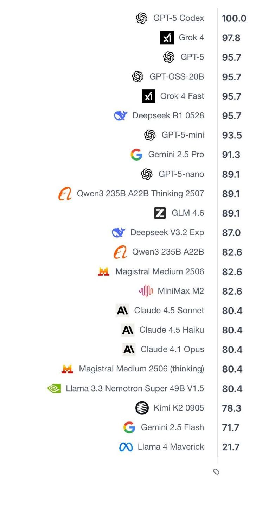

# 바이브 코딩 기초와 교육활용 및 실무

목표: 바이브 코딩의 활용과 교육 활용

---

https://weniv.github.io/minhogame/

---

이제 배워서 만드는 시대가 아니라
만들면서 필요하면 배우는 시대가 되었습니다.

---

데이터분석, 웹 서비스, 앱 서비스, 게임

---

제주대 교육 사례

---

어제 발표된 모델별 수능 점수 비교 자료입니다. 25년도 기준으로 작성이 되었습니다.

---

수학 교육, 과학 교육, 역사 교육, 지리 교육을 할 때에도 만들어서 할 수 있습니다. (그 내용은 물론 선생님이 가르쳐 주셔야 합니다.)

---

1. **서울시 교육청 '생성형 AI 교육자료: ChatGPT 사례 중심으로'**
    * 바로가기: https://bit.ly/3PAtXpi
    
2. **경상북도 교육청 '생성형 AI 활용 길라잡이'**
    * 바로가기 : https://bit.ly/3PU7dBK
    
3. **인천광역시 교육청 'ChatGPT 이해와 교수학습가이드'**
    * 바로가기 : https://weniv.link/KjhDF9
    
4. **전라북도 교육청 '생성형 AI, 교사와 함께 수업을 디자인하다'**
    * 바로가기: https://bit.ly/3RzItym
    
5. **세종특별자치시 교육청 '챗GPT 대화형 인공지능 도구를 활용한 교수학습 활용 사례'**
    * 바로가기: https://bit.ly/3PAGjOh

---

---

# 지리 교육

"나는 지리 선생님이야. 제주도의 오름을 학습하는 인터랙티브 지도를 만들고 싶어. Python의 folium 라이브러리를 사용해서 제주도 지도에 대표적인 오름 3곳(성산일출봉, 다랑쉬오름, 용눈이오름)을 마커로 표시하고, 각 마커를 클릭하면 해당 오름의 이름, 높이, 특징을 팝업으로 보여주는 HTML 파일을 만들어줘. 지도의 중심은 제주도(위도 33.3617, 경도 126.5292)로 하고 줌 레벨은 10으로 설정해줘."

---

## 지리 교육 실습

1. **Claude Code에 프롬프트 입력**
2. **생성된 HTML 파일 확인**
3. **브라우저에서 지도 확인**
4. **오름 위치와 정보 확인**

---

## 지리 교육 활용 예시

* 지역별 특산물 지도 만들기
* 세계 주요 도시 표시하기
* 한반도 지형 시각화하기
* 기후대별 분류 지도 만들기

---

# 역사 교육

"나는 역사 선생님이야. 청산리 대첩을 재현하는 3D 시뮬레이션 게임을 만들고 싶어. Three.js를 사용해서 독립군과 일본군이 전투하는 장면을 구현하고 싶어. 간단하게 지형(산과 계곡)을 만들고, 독립군 유닛 5개와 일본군 유닛 10개를 배치해줘. 키보드 방향키로 카메라를 회전할 수 있게 하고, 스페이스바를 누르면 전투가 시작되도록 해줘. 독립군이 유리한 지형을 활용하는 전략을 시각적으로 보여주는 HTML 파일을 만들어줘."

---

## 역사 교육 실습

1. **Three.js 기반 게임 생성**
2. **역사적 사건 시뮬레이션**
3. **게임 플레이 및 학습 효과 확인**
4. **추가 기능 구상하기**

---

## 역사 교육 활용 예시

* 임진왜란 주요 전투 시뮬레이션
* 독립운동 타임라인 인터랙티브 제작
* 고대 문명 건축물 3D 모델링
* 역사적 인물 카드 게임 제작

---

# 과학 교육

"나는 중학교 과학 선생님이야. 태양계 행성의 공전과 자전을 시각적으로 학습할 수 있는 3D 시뮬레이션을 만들고 싶어. Three.js를 사용해서 태양, 수성, 금성, 지구, 화성을 구현해줘. 각 행성은 실제 공전 주기 비율을 반영해서 움직이고, 자전도 함께 표현해줘. 태양은 빛을 발하는 효과를 주고, 지구에는 달도 추가해줘. 마우스 드래그로 시점을 자유롭게 회전할 수 있고, 숫자 키 1-4를 누르면 각 행성에 카메라가 포커스되도록 해줘. 우측 상단에는 각 행성의 이름과 공전 주기 정보를 표시하는 HTML 파일을 만들어줘."

---

## 과학 교육 실습

1. **태양계 시뮬레이션 생성**
2. **행성의 공전과 자전 확인**
3. **시각적 학습 효과 체험**
4. **다른 행성 추가해보기**

---

## 과학 교육 활용 예시

* 세포 구조 3D 모델링
* 화학 반응식 시뮬레이션
* 물리 법칙 실험 도구 제작
* 생태계 먹이사슬 시각화

---

# 데이터 분석 교육

"나는 고등학교 정보 선생님이야. 학생들에게 데이터 분석 과정을 가르치고 싶어. Python의 pandas, matplotlib, seaborn 라이브러리를 사용해서 샘플 학생 성적 데이터(30명, 과목: 국어, 영어, 수학, 과학, 사회)를 생성하고 분석하는 주피터 노트북 스타일의 Python 코드를 만들어줘. 다음 단계를 포함해줘: 1) 데이터 생성 및 불러오기, 2) 기술통계량 확인(평균, 중앙값, 표준편차), 3) 결측치 확인, 4) 과목별 성적 분포 히스토그램, 5) 과목 간 상관관계 히트맵, 6) 학생별 총점 계산 및 상위 5명 출력. 각 단계마다 주석으로 설명을 추가해줘."

---

## 데이터 분석 교육 실습

1. **데이터 수집 및 불러오기**
2. **데이터 전처리 및 정제**
3. **탐색적 데이터 분석 (EDA)**
4. **시각화 및 인사이트 도출**

---

## 데이터 분석 활용 예시

* 학급 성적 분석 및 시각화
* 학생 설문 데이터 분석
* 출결 데이터 패턴 분석
* 도서관 대출 통계 분석

---

# 수학 교육

"나는 고등학교 수학 선생님이야. 이차함수 `y = ax**2 + bx + c`의 개념을 시각적으로 가르칠 수 있는 인터랙티브 도구를 만들고 싶어. HTML 파일로 만들어줘. Chart.js나 D3.js를 사용해서 -10부터 10까지의 x값에 대한 그래프를 그려줘. a, b, c 계수를 각각 조절할 수 있는 슬라이더를 만들고(a: -5부터 5, b: -10부터 10, c: -10부터 10), 슬라이더를 움직이면 실시간으로 그래프가 변하도록 해줘. 화면에는 현재 함수식(예: `y = 2x**2 - 3x + 1`), 꼭짓점 좌표, 판별식 값, 그래프의 볼록/볼록 여부를 표시해줘. 그래프에는 격자와 축을 명확하게 표시하고, 꼭짓점에 점을 찍어줘."

---

## 수학 교육 실습

1. **함수 그래프 시각화 도구 생성**
2. **슬라이더로 계수 조절하기**
3. **그래프 변화 관찰하기**
4. **수학적 개념 이해하기**

---

## 수학 교육 활용 예시

* 삼각함수 그래프 시뮬레이션
* 확률 시뮬레이션 게임
* 도형의 넓이 계산 도구
* 통계 분포 시각화

---

# 바이브 코딩 활용 팁

1. **명확한 요구사항 전달하기**
2. **단계별로 기능 추가하기**
3. **생성된 코드 이해하고 수정하기**
4. **학생들과 함께 개선하기**

---

# 주의사항 및 윤리적 사용

1. **학생 개인정보 보호**
2. **생성 결과 검증하기**
3. **교육 목적에 맞게 활용하기**

---

## AI 리터러시 교육

**학생들에게 가르쳐야 할 것:**
* AI는 도구이지 대체물이 아님
* 비판적 사고의 중요성
* 결과물에 대한 책임감
* 윤리적 사용 방법

---

# 실제 수업 적용 사례

1. **프로젝트 기반 학습**
2. **플립러닝 자료 제작**
3. **개별화 학습 도구**
4. **평가 및 피드백 도구**

---

## 수업 적용 단계

**1단계:** 교사가 먼저 도구 만들어보기
**2단계:** 학생들에게 시연하기
**3단계:** 학생들과 함께 만들기
**4단계:** 학생들이 직접 만들기