{center}
이 강의자료는 무료로 배포합니다. 필요하신 경우 출처만 밝히시고 사용하시면 됩니다.
{/center}

---

# 바이브 코딩 (Vibe Coding) 부트캠프

코딩 없는 4일간 부트캠프입니다. 바이브 코딩과 바이브 디자인을 배웁니다. 일반인 과정과 직장인 과정이 있습니다. 자세한 내용은 '제주코딩베이스캠프' 유튜브 채널이나 위니브 홈페이지를 참고해주세요.

---

# 일자별 커리큘럼

* day1: 바이브 코딩 세팅, 요구사항 명세를 통한 바이브코딩 시연, 요구사항 명세 작성 방법, 현재 바이브 코딩의 한계와 미래, Front-end와 Back-end 기초지식, 게임 개발 기초 지식, GitHub 기초지식, 인프라 기초지식, 디자인 설계, 배포란, 바이브 코딩 실습, 바이브 코딩의 프롬프트 입력 방법, 과제1
* day2: 바이브 디자인, 요구사항과 디자인 설계 입력, 과제2
* day3: 결제 등 고급 기능 설계, 고급 기능을 위해 알아야 할 지식, final 과제3
* day4: 각자 제작한 결과물 발표

---

# 바이브 코딩이란?

SW 생산의 새로운 패러다임입니다. AI와 함께 대화하면서 코드를 생성하고, 수정하며, 실행하는 방식입니다. 특히 이전처럼 Code를 켜는 것이 아니라 AI 발전으로 '자연어'만으로 원하는 것을 만들 수 있게 되었습니다.

---

{center}
그래서 어디까지 만들 수 있나요?
{/center}

---

{center}
여러분이 보고 있으신 이 서비스도 바이브 코딩으로 만들어졌습니다.
{/center}

---

* 간단한 회사 소개 렌딩 페이지
* 간단한 게임
* 간단한 쇼핑몰
* 간단한 게시판
* 간단한 블로그
* 간단한 게스트하우스 페이지 

---

{center}
복잡한 것은 못만드나요?
{/center}

---

만들 수는 있지만, 여러분이 그 복잡함을 이해할 수 있어야 하며, 이를 위한 준비도 해야 합니다. 예를 들어, 복잡한 요구사항 명세 등을 작성할 수 있어야 하며, 이 명세를 통해 작성된 코드를 어느정도는 이해할 수 있어야 합니다. 전혀 이해하지 않고도 가능하지만, `권한 한계`가 분명 있습니다.

---

{center}
`권한 한계`는 무엇인가요?
{/center}

---

예를 들어, 여러분이 쇼핑몰을 만들고 싶다고 가정해봅시다. 코드를 작성하는 것 외에, 어떤 작업이 필요할까요? 

* 배포할 서버를 구매합니다.(보통은 클라우드) 
* 도메인을 구매하고 연결합니다.
* 결제를 위한 사업자 인증을 한 후 결제 시스템을 연동합니다.

---

이 과정은 결제 또는 인증이 일어나게 됩니다. 이러한 인간의 고유 `권한`이 들어가는 문제는 AI가 직접 처리할 수 없습니다.

---

그럼 여기서 배우는 것은 무엇일까요?

* 코드를 AI와 함께 작성하는 방법, 디자인을 AI와 함께 설계하는 방법 (V)
* 배포할 서버를 선택 (V)
* 도메인을 구매하고 연결하는 방법 (V)
* 결제를 위한 사업자 인증을 한 후 결제 시스템을 연동합니다. (△)

---

# 바이브 코딩

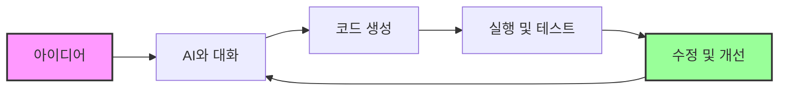

---

# 전통적 코딩 vs 바이브 코딩

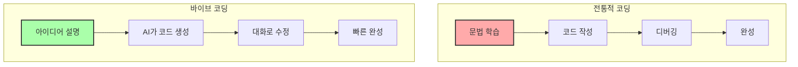

---

## 2. 사용 도구 🛠️

### 2.1 Claude Code

{xlarge}**가장 강력한 AI 코딩 도구**{/xlarge}

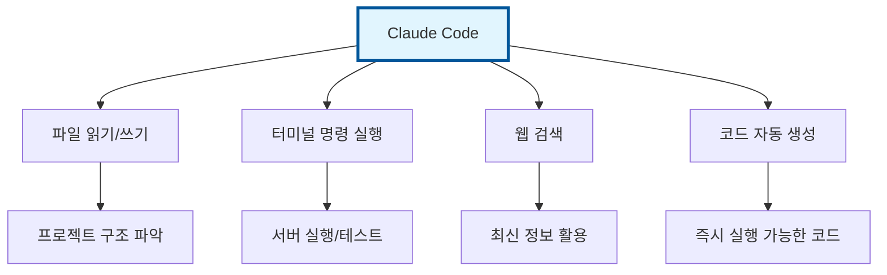

#### 주요 기능
- **자연어로 명령**: "로그인 페이지 만들어줘"
- **파일 자동 생성**: HTML, CSS, JavaScript 동시 생성
- **실시간 수정**: "버튼 색깔을 파란색으로 바꿔줘"
- **오류 자동 수정**: 에러 메시지만 보여주면 해결

---

### 2.2 Gemini CLI

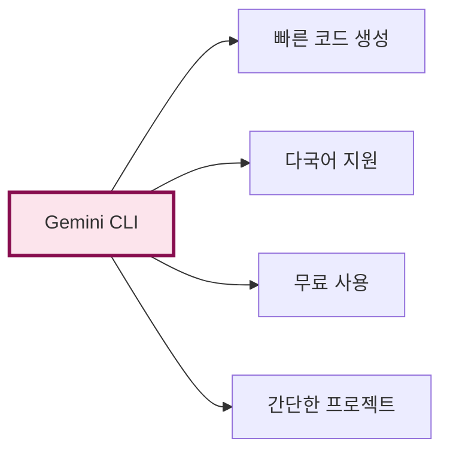

#### 특징
- Google의 AI 기술 활용
- 초보자 친화적 인터페이스
- 한국어 설명 우수

---

### 2.3 그 외 도구들

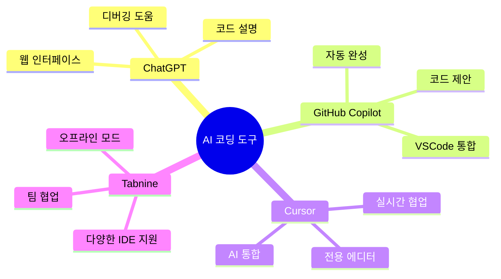

---

## 3. 프론트엔드 개발 🎨

### 웹페이지 만들기

{center}
**"내가 원하는 웹사이트를 말로 설명하면 만들어집니다!"**
{/center}

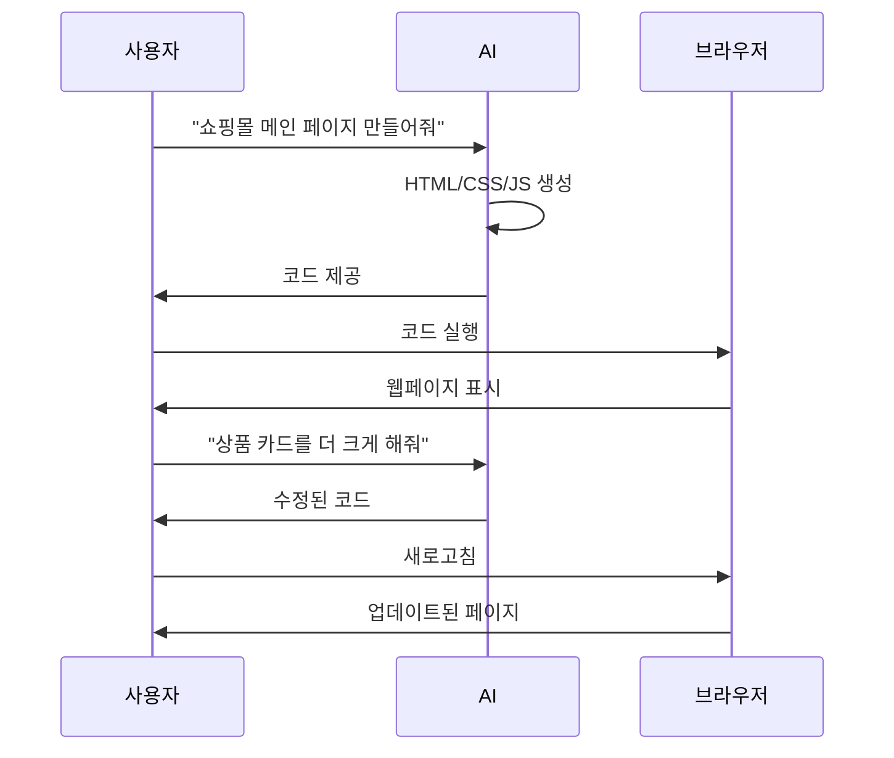

### 실전 예시

#### 1단계: 기본 구조 요청
```
"반응형 쇼핑몰 메인 페이지를 만들어줘. 
상단에 네비게이션 바, 중간에 상품 목록, 
하단에 푸터가 있으면 좋겠어."
```

#### 2단계: 세부 디자인 수정
```
"상품 카드에 호버 효과를 추가하고,
장바구니 담기 버튼을 넣어줘."
```

#### 3단계: 기능 추가
```
"장바구니에 담으면 우측 상단에 
개수가 표시되도록 해줘."
```

---

## 4. 백엔드 개발 🔧

### 서버와 데이터베이스

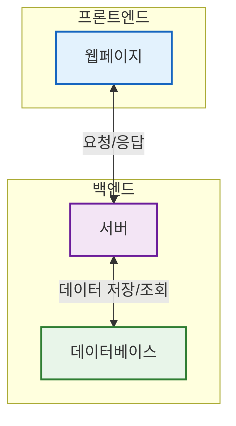

### AI로 백엔드 만들기

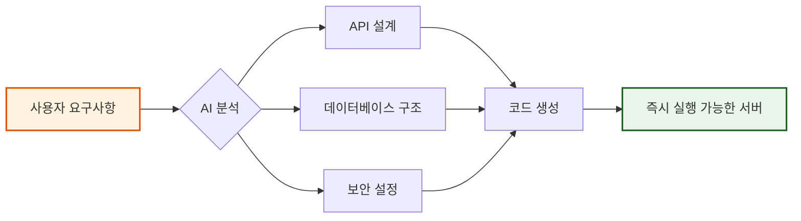

### 실전 예시
```
"Node.js로 간단한 블로그 API를 만들어줘.
글 작성, 수정, 삭제, 조회가 가능해야 해."
```

---

## 5. 게임 개발 🎮

### 간단한 게임 만들기

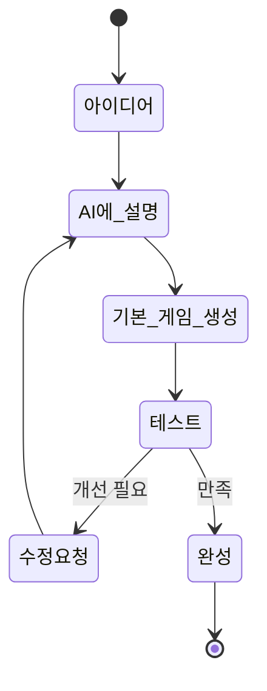

### 게임 개발 프로세스

#### 1. 게임 아이디어 설명
```
"벽돌깨기 게임을 만들어줘. 
공이 벽돌에 부딪히면 벽돌이 사라지고,
모든 벽돌을 깨면 다음 스테이지로 넘어가게 해줘."
```

#### 2. 세부 기능 추가
```
"파워업 아이템을 추가해줘.
공 속도 증가, 패들 크기 증가 같은 거."
```

#### 3. 난이도 조절
```
"스테이지가 올라갈수록 공 속도가 빨라지고
벽돌 개수가 늘어나게 해줘."
```

---

## 6. 기획서 및 요구사항 명세 작성 📋

### 좋은 요구사항의 구조

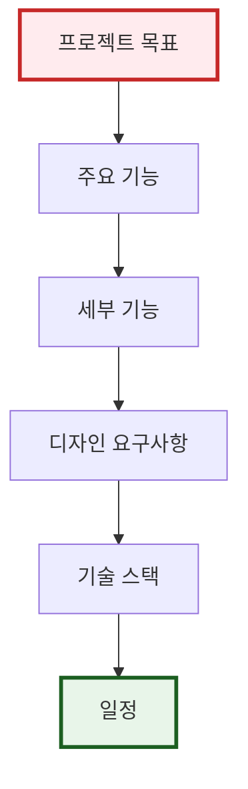

### 효과적인 명세서 템플릿

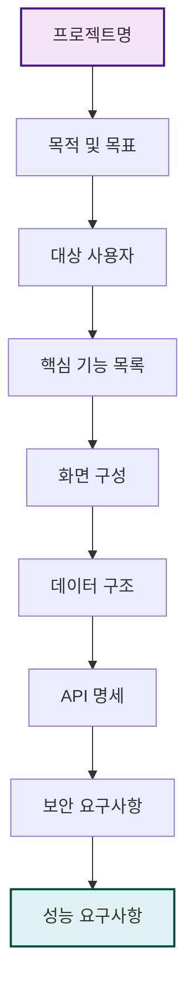

### 실제 예시

{highlight}**온라인 도서관 시스템**{/highlight}

1. **목표**: 도서 대출/반납을 온라인으로 관리
2. **주요 기능**:
   - 도서 검색
   - 대출 신청
   - 반납 처리
   - 연체 관리
3. **사용자**: 학생, 교직원, 관리자
4. **기술 요구사항**: 웹 기반, 모바일 반응형

---

## 7. TODO 제작하기 ✅

### 효과적인 TODO 관리

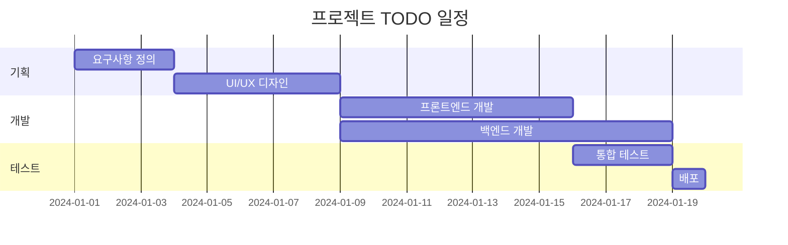

### AI를 활용한 TODO 생성

```
"온라인 쇼핑몰 프로젝트의 TODO 리스트를 만들어줘.
우선순위와 예상 소요시간도 포함해줘."
```

#### AI가 생성하는 TODO 예시

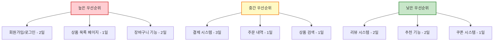

---

## 8. 효과적인 명령하기 💬

### 좋은 명령 vs 나쁜 명령

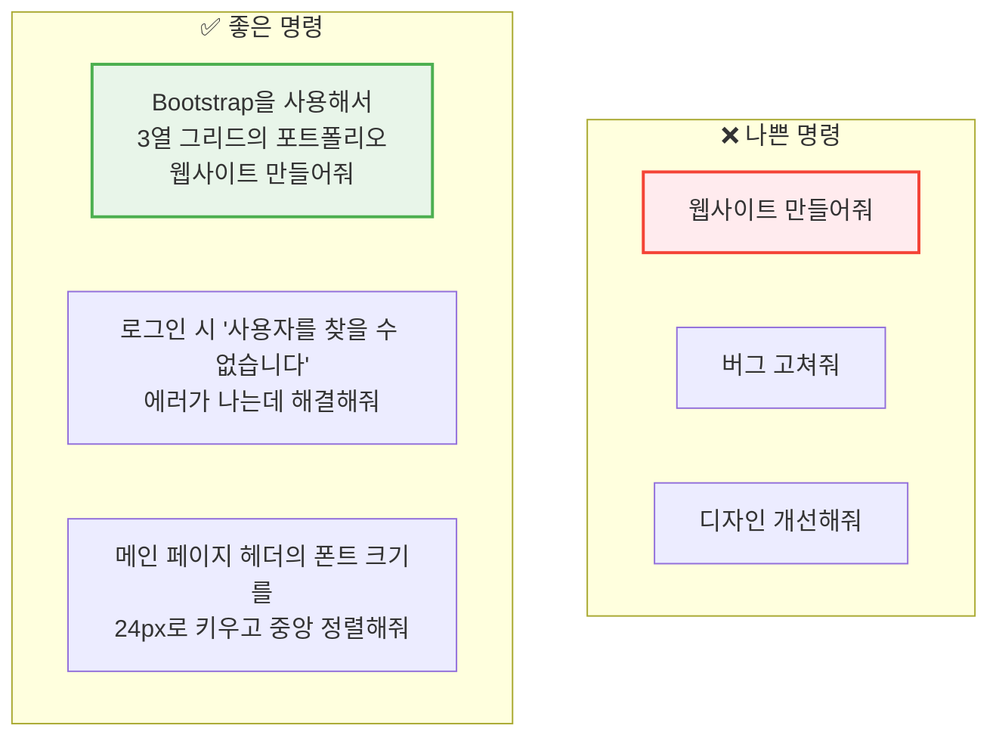

### 명령 구조화 팁

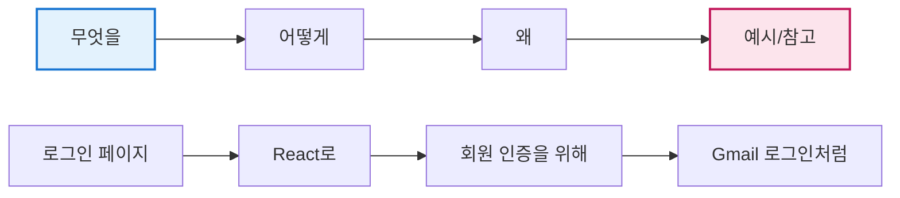

### 단계별 명령 전략

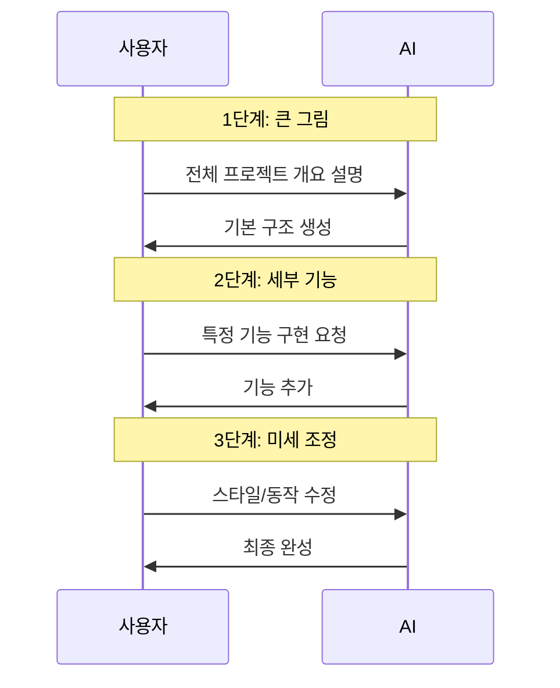

---

## 9. 실전 과제 🎯

### 과제 1: 개인 포트폴리오 웹사이트

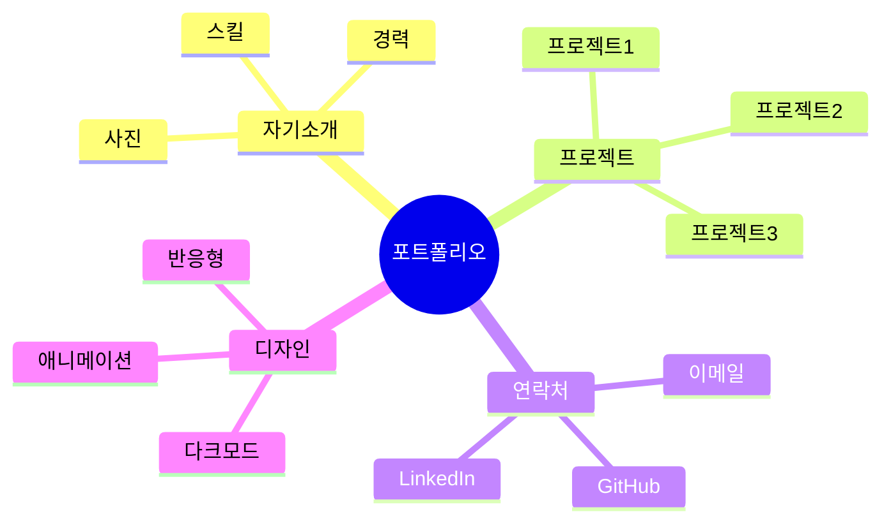

**AI에게 이렇게 요청하세요:**
```
"개인 포트폴리오 웹사이트를 만들어줘.
- 자기소개 섹션
- 프로젝트 갤러리 (카드 형식)
- 연락처 폼
- 반응형 디자인
- 부드러운 스크롤 효과"
```

---

### 과제 2: TODO 앱 만들기

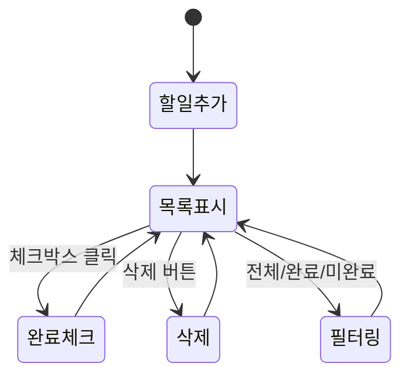

**단계별 진행:**
1. "간단한 TODO 리스트 앱을 만들어줘"
2. "로컬 스토리지에 저장되도록 해줘"
3. "완료한 항목은 회색으로 표시해줘"
4. "필터 기능을 추가해줘"

---

### 과제 3: 간단한 게임

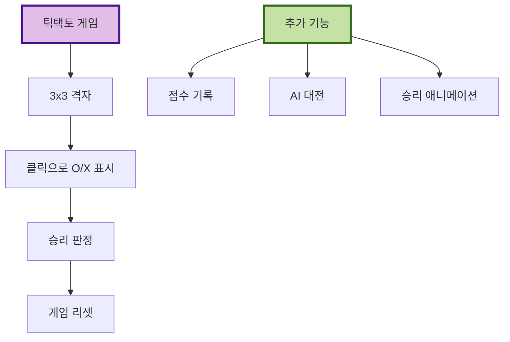

---

## 마무리 🎉

### 바이브 코딩의 핵심

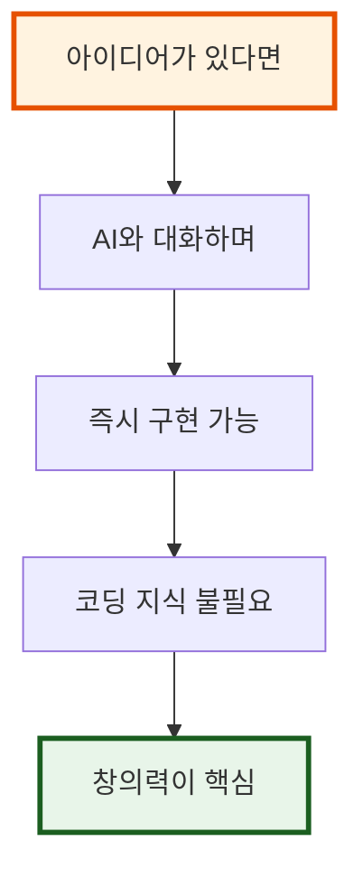

{center}
{xlarge}**"코드를 몰라도 만들 수 있다!"**{/xlarge}
{/center}

### 기억할 점

1. **구체적으로 설명하기**: 원하는 것을 자세히 설명
2. **단계별로 진행하기**: 한 번에 모든 걸 요구하지 않기
3. **피드백 주기**: AI가 만든 것을 보고 수정 요청
4. **실험하기**: 다양한 방법 시도

---

## Q&A 💡

자주 묻는 질문들:

1. **Q: 정말 코딩을 전혀 몰라도 되나요?**
   - A: 네! AI가 모든 코드를 생성합니다.

2. **Q: 어떤 프로젝트를 만들 수 있나요?**
   - A: 웹사이트, 앱, 게임, 자동화 도구 등 거의 모든 것!

3. **Q: AI가 만든 코드는 안전한가요?**
   - A: 기본적으로 안전하지만, 중요한 프로젝트는 전문가 검토 추천

{center}
**행운을 빕니다! 🚀**
{/center}