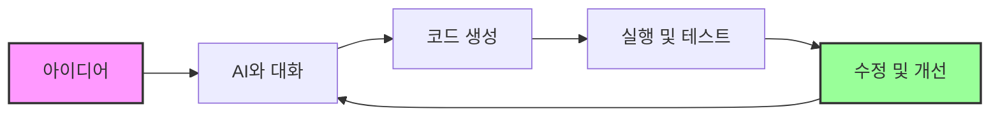
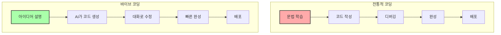

# 바이브 코딩 (Vibe Coding) 부트캠프

코딩 없는 4일간 부트캠프입니다. 바이브 코딩과 바이브 디자인을 배웁니다. 일반인 과정과 직장인 과정이 있습니다. 자세한 내용은 '제주코딩베이스캠프' 유튜브 채널이나 위니브 홈페이지를 참고해주세요.

---

# 일자별 커리큘럼

* day1: 바이브 코딩 세팅, 요구사항 명세를 통한 바이브코딩 시연, 요구사항 명세 작성 방법, 현재 바이브 코딩의 한계와 미래, Front-end와 Back-end 기초지식, 게임 개발 기초 지식, GitHub 기초지식, 인프라 기초지식, 디자인 설계, 배포란, 바이브 코딩 실습, 바이브 코딩의 프롬프트 입력 방법, 과제1
* day2: 바이브 코딩을 위한 디자인, UI/UX 디자인 기초 지식, Claude Code 디자인 적용 방법, 생성형 AI 활용 브랜드 디자인, Figma 기초, 과제2
* day3: 결제, 백엔드 연결 등 고급 기능 설계, 고급 기능을 위해 알아야 할 지식, final 과제3
* day4: 각자 제작한 결과물 발표

---

# 바이브 코딩이란?

SW 생산의 새로운 패러다임입니다. AI와 함께 대화하면서 코드를 생성하고, 수정하며, 실행하는 방식입니다. 특히 이전처럼 Code를 짜는 것이 아니라 AI 발전으로 '자연어'만으로 원하는 것을 만들 수 있게 되었습니다.

---

{center}
백문이 불여일견
{/center}

---

이렇게 쉽게 만들 수 있다면, 시장 가격도 낮아질까요?

---

물론입니다. 이미 아는 대표님이 매우 낮은 가격으로 제공하고 있으신 것을 보았습니다. 바이브 코딩으로 이 단가가 나온다고 하시더군요. 50만원대에 프론트와 백엔드를 다 하고 있으셨습니다. 이전이었으면 말도 안되는 단가죠.

그럼에도 앞으로는 여러분이 직접 만들 수 있기 때문에 의뢰를 하는 것보다 직접 만드는 것을 더 선호하게 될 것입니다. 자연어로 만들 수 있기 때문이죠.

---

{center}
그래서 어디까지 만들 수 있나요?
{/center}

---

{center}
여러분이 보고 있으신 이 서비스도 바이브 코딩으로 만들어졌습니다.
{/center}

---

* 간단한 회사 소개 렌딩 페이지
* 간단한 게임 (Asset이 있다면 더 멋지게 가능)
* 간단한 쇼핑몰
* 간단한 게시판
* 간단한 블로그
* 간단한 게스트하우스 페이지 

---

{center}
복잡한 것은 못만드나요?
{/center}

---

만들 수는 있지만, 여러분이 그 복잡함을 이해할 수 있어야 하며, 이를 위한 준비도 해야 합니다. 예를 들어, 복잡한 요구사항 명세 등을 작성할 수 있어야 하며, 이 명세를 통해 작성된 코드를 어느정도는 이해할 수 있어야 합니다. 전혀 이해하지 않고도 가능하지만, `권한 한계`가 분명 있습니다.

---

{center}
`권한 한계`는 무엇인가요?
{/center}

---

예를 들어, 여러분이 쇼핑몰을 만들고 싶다고 가정해봅시다. 코드를 작성하는 것 외에, 어떤 작업이 필요할까요? 

* 배포할 서버를 구매합니다.(보통은 클라우드) 
* 도메인을 구매하고 연결합니다.
* 결제를 위한 사업자 인증을 한 후 결제 시스템을 연동합니다.

---

그리고 구매한 것들을 연결하고, 배포합니다.

---

이 과정은 결제 또는 인증이 일어나게 됩니다. 이러한 인간이 관여해야하는 `권한` 문제는 AI가 직접 처리할 수 없습니다.

---

또한 쉽게 되지도 않습니다. 예를 들어, 결제 시스템을 연동하기 위해서는 사업자 인증, 결제 시스템 연동, 도메인 연결 후 다시 인증 등 복잡한 과정이 필요합니다. 단지 코드로 만드는 것만으로는 해결되지 않습니다.

이러한 권한이 들어가는 부분은 시간과 노력을 들여 별도로 배워야 합니다. 다만, 이러한 부분들도 대체할만한 서비스들이 있습니다. 예를 들어, 네이버 페이 연동은 어렵지만, 이미 만들어진 스토어를 연결하는 것은 보다 쉽습니다.

---

여기서 배우는 것은 무엇인가요?

* 코드를 AI와 함께 작성하는 방법, 디자인을 AI와 함께 설계하는 방법 (V)
* 배포할 서버를 선택 (V)
* 도메인을 구매하고 연결하는 방법 (V)
* 결제를 위한 사업자 인증을 한 후 결제 시스템을 연동합니다. (일부)

---

직접 해보고 싶어요!

---

Gemini CLI를 사용해보세요. 무료로 사용할 수 있습니다. 다만 Claude Code와 같은 유료 모델을 사용하면 더 좋은 결과를 얻을 수 있습니다. 차이가 매우 큽니다.

---

아래 작업 중 Claude Code와 Gemini CLI 모두 1번과 2번은 동일합니다. 3번 설치 과정에서 window는 애러가 많이 발생하니, 애러가 발생되는 분들은 다음 페이지로 이동해주세요.

1. VSCode 설치: https://code.visualstudio.com/
2. Node 설치: https://nodejs.org/ko/download
3. Gemini CLI 설치: 
    3.1 Windows: `npm install -g @google/gemini-cli`
    3.2 Mac: `sudo npm install -g @google/gemini-cli`

* 설치를 하는 중간에 Ok to proceed? 라는 질문이 나오면 y를 입력해주세요.
* 엔터를 치다보면 아래와 같은 `Login with Google`이라는 메시지 선택장이 뜨는데 엔터 눌러주시면 됩니다. 


---

Window error: 빨간색으로 'npm is not recognized as an internal or external command, operable program or batch file.' 또는 'npm: 이 시스템에서 스크립트를 실행할 수 없으므로 ~파일을 로드할 수 없습니다. ~ 보안오류 ~'

해결책: `Set-ExecutionPolicy -Scope Process -ExecutionPolicy Bypass` 명령어 실행한 다음 대문자 A 입력. 대문자 A가 '모두 예(A)' 입니다. 만약 이 명령어가 작동하지 않는다면, 관리자 권한으로 PowerShell을 실행한 후 다시 시도해보세요.

---

* 실행은 터미널에서 `gemini` 명령어로 시작합니다.
* 종료는 `/quit` 명령어로 종료합니다.

---

기본 명령어

```
/help: 전체 명령어
/tools: 사용 가능한 AI 도구 목록
/session: 세션 정보
Shell 모드 전환:
    * !입력 1번: 쉘 모드 전환
    * !입력 2번: 쉘 모드 종료(입력모드)
/quit: 종료
```

---

잠시 가벼운 실습을 해보는 시간을 가져보겠습니다. 
먼저 VSCode에 폴더가 선택이 되어 있어야 하는데요.
File > Open Folder를 통해 폴더를 선택해주세요. 그리고 아래 명령어를 입력합니다.

```
프롬프트: 나는 바이브코딩을 하는 렌딩 페이지를 간단히 하나 만들고 싶어. html, css로 간단하게 만들어줘.
```

---

Claude Code도 가능합니다. 다만 Pro 계정 이상이 필요합니다. 월 20달러입니다. 명령어는 비슷합니다.

* Claude Code의 상세 팁은 3일차에 진행합니다. 팁들을 직접 해보고 싶으신 분들은 구매하고 설치해서 오세요.

* window
```
npm install -g @anthropic-ai/claude-code
claude auth login
claude
```

* mac
```
sudo npm install -g @anthropic-ai/claude-code
claude auth login
claude
```

---
# 바이브 코딩

{center}

{/center}

---

# 전통적 코딩 vs 바이브 코딩

{center}

{/center}

---

* 아이디어를 잘 설명하는 것이 중요합니다. 이 작업을 위해 '요구사항 명세'를 작성하는 방법을 배웁니다.
* AI(모델)를 선택하는 것도 중요합니다. Gemini CLI, Claude Code가 있습니다. 무엇을 선택하시든 충분한 비용을 지불하지 않으면 원하는 결과를 얻기 어렵습니다. 예를 들어 Gemini CLI는 무료로 사용할 수 있지만, 우리가 원하는 수준의 결과를 만들 수는 없습니다.

---

* 그럼 우리는 결과물을 어떻게 만드나요? 물론 여러분이 직접 Gemini CLI로 결과물을 만들 수도 있지만 무료 버전이기 때문에 결과물의 퀄리티가 그리 좋지 않습니다.
* 따라서 여러분이 요구사항 명세를 상세히 만들면, 강사가 이 명세를 가지고 Claude Code로 프로토타입을 만들고, 여러분은 '무료'로 제공되는 Gemini CLI를 통해 이 프로토타입을 수정할 예정입니다.