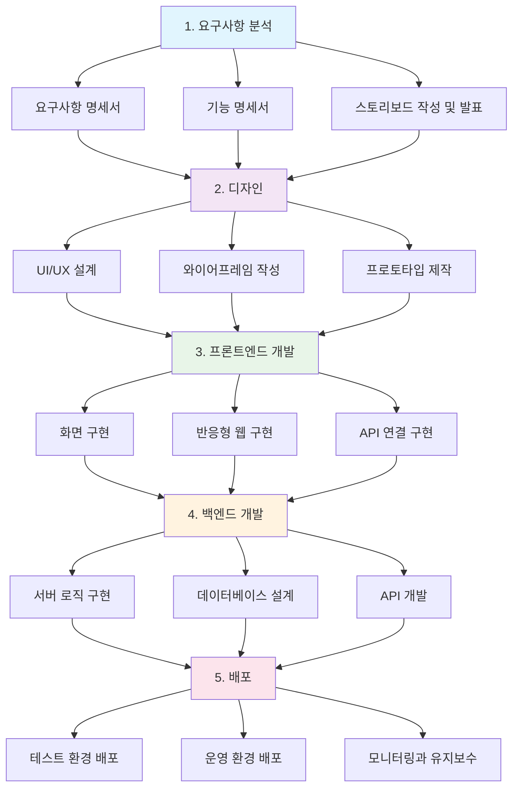

{center}
프론트 엔드
{/center}

---

여러분이 보는 화면, 그것이 프론트 엔드 입니다.

---

개념 훑어보기
* URL: 이름
* PORT: 문
* IP: 주소

---


---

# 개발 프로세스



---

Front-end 구성요소

* HTML: 구조/뼈대
* CSS: 디자인/스타일링
* JavaScript: 동작/상호작용

---


---

로또 번호 바꾸기 실습

* 재미로 하는 것 아니고, 실제로 여러분이 쓰셔야 하는 기능입니다.
* 개발자 도구에 대한 강의는 강의 쿠폰을 지급이 됩니다.
* elements, console, application, network 탭을 주로 사용합니다.

---

# HTML

```html
<h1>안녕하세요.</h1>
<p>이것은 HTML 문서입니다.</p>
```

---

# CSS

```css
<style>
h1 {
    color: blue;
}
</style>
```

---

# JavaScript

```javascript
<script>
alert("안녕하세요!!");
</script>
```

---

# 프론트엔드 개발자가 하는 일
* 화면 설계 구현
* 사용자 경험(UX) 개선
* 반응형 웹 개발
* 백엔드 데이터 연결

---

# 백엔드 데이터 연결
프롬프트: `https://dev.wenivops.co.kr/services/fastapi-crud/1/product`에 아래와 같은 데이터 구조를 가진 데이터가 있습니다. 이 데이터를 화면에 출력하는 HTML, CSS, JS코드를 아주 쉽게 작성해주세요.

```
[
  {
    id: int, // 상품 id
    productName: string, // 상품명
    price: int, // 가격
    stockCount: int, // 재고
    thumbnailImg: string, // 썸네일 이미지 경로
    option: [ // 상품 옵션(array)
      {
        id: int, // 옵션 id
        optionName: string, // 옵션명
        additionalFee: int // 옵션 추가금
      },
      ...
    ],
    discountRate: int, // 할인율
    shippingFee: int, // 배송비
    detailInfoImage: [string, string, ...], // 상품 상세 이미지 경로(array)
    viewCount: int, // 조회수
    pubDate: str, // 작성일자
    modDate: str, // 수정일자
  },
...
]
```

---

{center}
[프롬프트로 만든 페이지 바로가기](./바이브코딩/001.html)
{/center}

---

# 전통 개발 과정

1. 기획, 스토리보드
2. 피그마 디자인
3. HTML / CSS / JavaScript 개발
4. 반응형 개발

---

# 바이브 코딩

1. 기획
2. AI를 통한 프로토타입
3. 발주처와 대화하면서 실시간 수정
4. 디자이너가 다듬기
5. 최종 수정

---

아무것도 모르고 '아몰랑 자연어 개발'도 가능합니다.

---

# 바이브 코딩 기술 선택
* (추천) HTML/CSS/JavaScript: 기본기 중요, 모든 프레임워크의 기초
* (추천) Tailwind CSS: 유틸리티 기반 CSS 프레임워크
* (초급자가 하기 어려움 2) React: 컴포넌트 기반, 재사용성 높음
* (초급자가 하기 어려움 1) Vue.js: 학습 곡선 완만, 한국에서 인기
* (초급자가 하기 매우 어려움) Next.js: React 기반 풀스택 프레임워크
* (초급자가 하기 매우 어려움) TypeScript: JavaScript의 상위 집합, 타입 안정성 제공
* (어려운 것은 아님) Bootstrap: 빠른 프로토타이핑, 반응형 디자인 지원