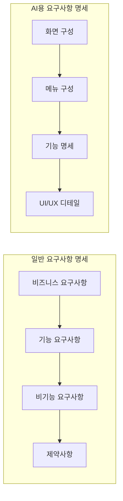

{center}
요구사항 명세 작성법
{/center}

---

# 요구사항 명세가 뭔가요?

AI에게 "이런 걸 만들어줘"라고 설명하는 설계도입니다. 건축할 때 도면이 필요하듯이, 개발할 때도 명세서가 필요합니다.

---

# 일반 요구사항 명세 vs AI용 요구사항 명세



---

# 실무 요구사항 명세와의 차이점

실무에서는:
* 승인 프로세스가 복잡합니다
* 법적 책임이 따릅니다
* 변경 관리가 엄격합니다
* 수십 페이지에 달하는 문서입니다

AI용은:
* 즉시 수정 가능합니다
* 대화하면서 개선합니다
* 프로토타입 중심입니다
* 간결하고 실행 가능해야 합니다

---

# AI용 요구사항 명세 구조

1. 프로젝트 개요
2. 화면 구성
3. 메뉴 구성  
4. 기능 명세
5. UI/UX 요구사항
6. 기술 스택

---

# 1. 프로젝트 개요

```
프로젝트명: 개인 TODO 관리 앱
목적: 일일 할 일을 체크리스트로 관리
사용자: 개인 사용자
플랫폼: 웹 브라우저
```

간단명료하게 한 줄로 설명할 수 있어야 합니다.

---

# 2. 화면 구성

```
메인 화면:
- 상단: 제목 및 날짜
- 중앙: TODO 리스트
- 하단: 새 TODO 추가 입력창

구성 요소:
- 헤더 영역 (고정)
- 콘텐츠 영역 (스크롤)
- 입력 영역 (하단 고정)
```

AI가 레이아웃을 이해할 수 있도록 구체적으로 설명합니다.

---

# 3. 메뉴 구성

```
주요 메뉴:
1. 전체 보기 (기본)
2. 완료된 항목 보기
3. 미완료 항목 보기
4. 설정

네비게이션:
- 상단 탭 형태
- 모바일에서는 하단 탭바
```

---

# 4. 기능 명세

```
핵심 기능:
1. TODO 추가
   - 텍스트 입력 후 Enter 또는 추가 버튼
   - 빈 내용은 추가 불가
   
2. TODO 완료 처리
   - 체크박스 클릭으로 완료/미완료 토글
   - 완료시 취소선 표시
   
3. TODO 삭제
   - 삭제 버튼 클릭
   - 확인 다이얼로그 표시

4. TODO 수정
   - 더블클릭으로 편집 모드
   - Enter로 저장, ESC로 취소
```

---

# 5. UI/UX 요구사항

```
디자인 컨셉:
- 미니멀하고 깔끔한 디자인
- 화이트/그레이 계열 색상
- 완료된 항목은 연한 회색

인터랙션:
- 버튼 호버시 색상 변경
- 부드러운 애니메이션 효과
- 반응형 디자인 (모바일 대응)

접근성:
- 키보드 네비게이션 지원
- 충분한 클릭 영역 크기
```

AI가 구체적인 스타일을 구현할 수 있도록 상세히 기술합니다.

---

# 6. 기술 스택

```
프론트엔드:
- HTML5
- CSS3 (또는 Tailwind CSS)
- Vanilla JavaScript

데이터 저장:
- localStorage (브라우저 로컬 저장)

호환성:
- 모든 모던 브라우저
- 모바일 브라우저 지원
```

---

# TODO 앱 실습 요구사항 명세

```
프로젝트명: 심플 TODO 리스트
목적: 개인 일정 관리용 웹 애플리케이션

화면 구성:
- 헤더: "My TODO List" 제목, 현재 날짜
- 메인: TODO 항목들 (체크박스, 텍스트, 삭제 버튼)
- 푸터: 새 TODO 입력창과 추가 버튼

메뉴 구성:
- 전체 보기 (All)
- 진행중 (Active) 
- 완료됨 (Completed)
- 통계 (남은 할일 개수 표시)

핵심 기능:
1. TODO 추가: 입력 후 Enter 또는 추가 버튼
2. TODO 완료: 체크박스로 상태 변경
3. TODO 삭제: X 버튼으로 개별 삭제
4. TODO 수정: 항목 더블클릭으로 인라인 편집
5. 전체 삭제: 완료된 항목 일괄 삭제
6. 필터링: 상태별 필터 기능

UI/UX:
- 깔끔한 카드 디자인
- 완료된 항목은 취소선과 회색 처리  
- 부드러운 애니메이션 효과
- 반응형 디자인

기술 스택:
- HTML5, CSS3, JavaScript
- localStorage로 데이터 영속성
```

---

# 요구사항 명세 작성 팁

좋은 예:
```
"TODO 항목을 더블클릭하면 편집 모드로 전환되고, 
Enter키로 저장, ESC키로 취소합니다."
```

나쁜 예:
```
"TODO를 수정할 수 있어야 합니다."
```

---

# AI가 이해하기 쉬운 표현

구체적으로:
```
"상단에 파란색 헤더, 가운데 흰색 콘텐츠 영역"
```

추상적으로:
```
"예쁘게 만들어주세요"
```

---

# 실무와 AI용의 핵심 차이

실무 요구사항 명세:
* 책임 소재가 명확해야 함
* 변경시 승인 절차 필요
* 법적 구속력 있음
* 완벽해야 함

AI용 요구사항 명세:
* 즉시 수정 가능
* 대화하며 개선
* 프로토타입 목적
* 80% 완성도면 충분

---

# 다음 실습

지금 작성한 TODO 요구사항 명세를 Claude Code에 입력해서 실제 애플리케이션을 만들어보겠습니다.

---

# 요구사항 명세 연습 과제

다음 중 하나를 선택해서 요구사항 명세를 작성해보세요:

1. 간단한 계산기 앱
2. 날씨 정보 표시 앱  
3. 메모장 앱
4. 이미지 갤러리 앱

각자 작성한 명세를 다음 시간에 AI로 구현해보겠습니다.