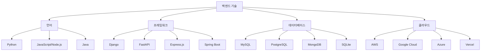

{center}
백엔드
{/center}

---

여러분이 보는 화면에서 일어나는 동작을 통해 데이터를 처리하고 저장하는 곳이 백엔드입니다.

---

다만 우리는 백엔드 개발을 깊게 하지 않습니다.
이미 개발되어진 '서비스'를 활용하여 필요한 기능을 구현합니다.

---

# 백엔드 개발자가 하는 일

* 프론트엔드 개발자에게 데이터 제공
* 서버 배포 및 관리
* 보안 처리
* 성능 최적화

---

# 데이터베이스 기초

데이터베이스는 정보를 체계적으로 저장하는 창고입니다.

https://sql.weniv.co.kr/ 에서 실습해볼 수 있습니다.

```sql
SELECT * FROM 상품;
```

---

# API란 무엇인가

Application Programming Interface의 줄임말로, 서로 다른 프로그램이 소통할 수 있게 해주는 약속입니다.

예시: 날씨 앱에서 기상청 데이터를 가져오는 것

---

# HTTP 메서드

* GET: 데이터 가져오기
* POST: 데이터 생성하기
* PUT: 데이터 수정하기
* DELETE: 데이터 삭제하기

---

```javascript
// API 사용 예시
fetch('https://dev.wenivops.co.kr/services/fastapi-crud/1/product')
  .then(response => response.json())
  .then(data => console.log(data));
```

---

# 백엔드 기술 스택



---

# 바이브 코딩으로 백엔드 만들기

프롬프트 예시

```
express.js를 사용해서 간단한 게시판 API를 만들어주세요. DB 없이 메모리를 사용해주세요. 가짜 데이터를 통해 게시글을 볼 수 있게 해주세요.
```

---

# 전통적 백엔드 개발 프로세스

1. 요구사항 분석
2. 데이터베이스 설계
3. API 설계
4. 서버 로직 구현
5. 테스트
6. 배포

---

# 데이터베이스 설계 예시

쇼핑몰 데이터베이스
- 사용자 테이블 (users)
- 상품 테이블 (products)
- 주문 테이블 (orders)
- 주문상품 테이블 (order_items)

셈플로 작성해둔 예시: https://github.com/weniv/project_sample_repo

---

# 바이브 코딩 백엔드 기술 선택

Spring이나 닷넷은 보지도 않으시는 것을 권합니다.

* (추천) Firebase: 코딩 없이 백엔드 기능을 제공
* (추천) Supabase: Firebase와 유사한 오픈소스 대안
* (추천하지만 어려움) FastAPI: Python 기반, 빠르고 현대적
* (추천하지만 어려움) Express.js: JavaScript/Node.js 기반, 간단함
* (초급자가 하기 매우 어려움) Django: Python 기반, 완전한 프레임워크
* (초급자가 하기 매우매우 어려움) Spring Boot: Java 기반, 엔터프라이즈급

---

# 바이브 코딩의 한계와 해결방안

한계
* 복잡한 비즈니스 로직
* 대용량 데이터 처리
* 고급 보안 요구사항

해결방안
* 처음부터 구현되어 있는 솔루션 사용(firebase, supabase 등)
* 단계별 구현
* 전문가 검토
* 지속적인 학습