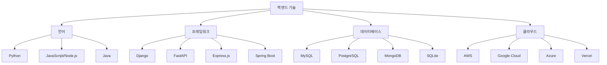

{center}
백엔드
{/center}

---

여러분이 보는 화면에서 일어나는 동작을 통해 데이터를 처리하고 저장하는 곳이 백엔드입니다.

---

백엔드는 3일차에 진행합니다. 여기는 시간이 가용하면 진행하고, 시간이 부족하면 별도의 강의자료를 통해 3일차에 진행합니다.

---

# 데이터베이스 기초

데이터베이스는 정보를 체계적으로 저장하는 창고입니다.

https://sql.weniv.co.kr/ 에서 실습해볼 수 있습니다.

```sql
SELECT * FROM 상품;
```

---

# API란 무엇인가

Application Programming Interface의 줄임말로, 서로 다른 프로그램이 소통할 수 있게 해주는 약속입니다.

예시: 날씨 앱에서 기상청 데이터를 가져오는 것

---

```javascript
// API 사용 예시
fetch('https://dev.wenivops.co.kr/services/fastapi-crud/1/product')
  .then(response => response.json())
  .then(data => console.log(data));
```

---

# 백엔드 기술 스택



---

언어를 하나 선택하셔야 합니다. Python을 권장합니다.

---

프레임워크를 하나 선택하셔야 합니다. Django를 권장합니다.

---

# 바이브 코딩으로 백엔드 만들기

프롬프트 예시

```
나는 유튜브와 같은 동영상 스트리밍 서비스를 개발할거야. 이러한 서비스를 개발하기 위해 요구사항 명세가 필요한데 나는 요구사항 명세를 작성해본적이 없어. 개발자도 아니야. 개발도 해본적이 없어. 바이브 코딩이 유행한다길래 한 번 따라해보고 있는 중이야. 

유튜브와 비슷한 서비스를 만들 것이니 유튜브 서비스에 근거하여 요구사항 명세를 작성해줘. 이렇게 작성된 것을 Claude Code에게 시킬 예정이야.
```

---

# 바이브 코딩 백엔드 기술 선택

Spring이나 닷넷은 언급도 하지 않겠습니다. 초급자가 하기에는 허들이 너무 높습니다.

* (추천) Firebase Studio: 백엔드 기능을 제공하는 플랫폼, 코딩 없이 사용 가능
* (추천하지만 어려움) Firebase: 코딩 없이 백엔드 기능을 제공
* (추천하지만 어려움) Supabase: Firebase와 유사한 오픈소스 대안
* (추천하지만 어려움) FastAPI: Python 기반, 빠르고 현대적
* (추천하지만 어려움) Express.js: JavaScript/Node.js 기반, 간단함
* (초급자가 하기 매우 어려움) Django: Python 기반, 완전한 프레임워크
* (초급자가 하기 매우매우 어려움) Spring Boot: Java 기반, 엔터프라이즈급

---

근데 왜 Django 추천하셨나요?

---

firebase studio는 google에서 만든 것이기 때문에 gemini 사용합니다. 앞으로 어떻게 될지 모르겠지만, 이런 AI 종속 툴은 우리가 원하는 시점에 원하는 만큼에 결과물을 못뽑아낼 수 있습니다.

---

Django는 '풀스택 프레임워크'입니다. 이거 하나로 Front-end, Back-end, DB, 관리자 페이지까지 웹 서비스에 필요한 모든 것을 할 수 있기 때문에 권해드린 것입니다.

---

어느 툴을 사용하시든 특정 복잡도 이상의 결과물을 내려고 하면 코드를 공부해야 합니다.